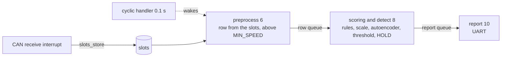

# ai_can_anomaly_detection

The application the entry runs. It builds a row from the slots every 0.1 s, scores it
with the rules and the autoencoder, and reports each alarm over UART.

Nothing writes the slots. `slots_store` is the one call that does, and the FDCAN receive
callback that makes it is the CAN side's work, as
[connecting_can_bus.md](../../docs/connecting_can_bus.md) describes. Until it is written
the application prints its first line, counts every tick as quiet and scores nothing.
It is a placeholder for the application that reads a bus.



The numbers are task priorities, smaller runs first. The application runs until the
board is reset.

## Priorities

A task sits in one of two layers, and the layer sets its priority.

The guaranteed layer holds the rules and the instant model. A row built in one tick is
scored and its alarm raised before the next tick. Nothing in it is dropped. The board
can promise this, with 0.90 ms of inference against a 0.1 s tick.

The best-effort layer holds detection the board cannot promise, since an ECU cannot
hold a model large enough. A windowed model is the one planned. It runs on the time the
guaranteed layer leaves and skips its inference when there is none. A skip loses only
the detections that model alone makes.

Filling the window belongs to the guaranteed layer. A row dropped before it enters the
buffer leaves a gap, and the model then scores a stretch of time that never happened.

Report is best effort by the same rule, since a late line loses nothing. It sits below
both guaranteed tasks.

## The model

It runs `nonlinear_ae_k16_h128`, the largest model of the export in
[`board/lib/deployed_model/`](../../lib/deployed_model), with the scale of the fit it
came from and the threshold `calibrate` took for it. The sample applications run a
smaller one from `board/lib/active_model/`, so changing one leaves the other alone.

The files come from the runs repository, `board/20260916-232708/nonlinear_ae_k16_h128/`
and `results/20260916-001002`. They are kept here so that the application builds from a
clone with nothing fetched.

## Prepare, build and flash

```sh
python3 -m board.prepare CUBEIDE_PROJECT_DIR ai_can_anomaly_detection
python3 board/flash.py CUBEIDE_PROJECT_DIR
```

## Size

`arm-none-eabi-size` of the image, built on 2026-09-22 in the Debug configuration,
which compiles at `-O0`.

| what | bytes |
|---|---|
| text | 84,500 |
| data | 2,548 |
| bss | 11,828 |
