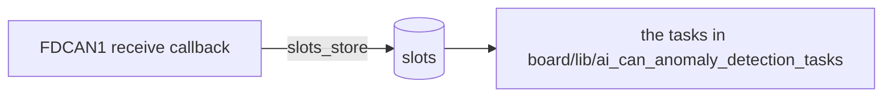

# ai_can_anomaly_detection

The application the entry runs. It builds a row from the slots every 0.1 s, scores it
with the rules and the autoencoder, and sends each start and end of the alarm on
FDCAN1.

FDCAN1 receives the frames, and its receive callback stores each one in the slots with
`slots_store`. [connecting_can_bus.md](../../docs/connecting_can_bus.md) has the FDCAN
settings, and how to send test frames from a PC and check the alarms against the PC
answer.


```mermaid
flowchart LR
    irq["FDCAN1 receive callback"] -- slots_store --> slots[(slots)]
    slots --> tasks["the tasks in board/lib/ai_can_anomaly_detection_tasks"]
```

The tasks after the slots are described in
[their README](../../lib/ai_can_anomaly_detection_tasks/README.md). The application runs
until the board is reset.

## The alarm frame

[report_can](../../lib/report_can/report_can_task.c) sends one frame when the alarm
starts or ends.

| field | value |
|---|---|
| ID | 0x0CFF0080, extended. Priority 3, PGN 0xFF00, source address 0x80 |
| byte 0 | 1 for start, 0 for end |
| bytes 1 to 4 | the row number, little endian |
| bytes 5 to 7 | 0xFF |

The row number counts ticks from when the board started. It is there to check the
board against the PC answer. When the transmit FIFO is full, the frames still waiting
are cancelled and the new one goes in.

## The model

It runs `nonlinear_ae_k8_h128` from
[`board/lib/deployed_model/`](../../lib/deployed_model), with the scale of the fit it
came from and the threshold `calibrate` took for it. The sample applications run their
own copy from `board/lib/active_model/`, so changing one leaves the other alone.

[fetch_model](../../fetch_model.py) writes the files from the runs repository,
`board/20260928-200316/nonlinear_ae_k8_h128/`, the scale of `models/20260928-112526` and
the threshold of `thresholds/20260928-114811`. They are kept here so that the application builds from a
clone with nothing fetched.

## Prepare, build and flash

```sh
python3 -m board.prepare CUBEIDE_PROJECT_DIR ai_can_anomaly_detection
python3 board/flash.py CUBEIDE_PROJECT_DIR
```

## Receive callback time

`HAL_FDCAN_RxFifo0Callback` keeps the fewest and most cycles one call took in
`fewest_receive_cycles` and `most_receive_cycles`. The board prints nothing, so they are
read with the programmer while it runs. Their addresses are in the map file.

```sh
STM32_Programmer_CLI -c port=SWD mode=HOTPLUG -r32 ADDRESS 4
```

The time starts inside the callback. It leaves out the HAL interrupt handler that calls
it and the CPU's interrupt entry and exit. An interrupt during the callback adds to it.

On 2026-09-28 the Debug build, at `-O0` and 32 MHz, took 1,086 to 1,494 cycles, 34 to
47 us, while the Mac sent `part_3/20210204094457960567.csv`. All 50,001 frames reached
the frame ring.

## Size

`arm-none-eabi-size` of the image, built on 2026-09-22 with `nonlinear_ae_k16_h128` in the
Debug configuration, which compiles at `-O0`.

| what | bytes |
|---|---|
| text | 93,972 |
| data | 2,548 |
| bss | 11,932 |
