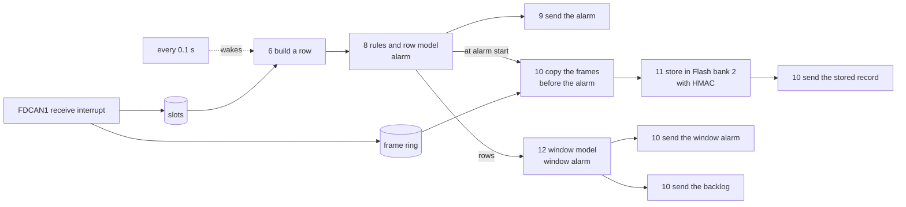

# ai_can_anomaly_detection

The main application on the board. It builds a row from the received frames every
0.1 s and scores it with the rules, the row model and the window model. It sends each
start and end of the alarm and the window alarm on FDCAN1. At each alarm start it
stores the frames before it in Flash bank 2, with an HMAC. It runs until the board is
reset.

[board_guide_ja.md](../../../guidelines/board_guide_ja.md) builds it, sends it a log
from a PC and reads what it sends back.

## Tasks and priorities

The numbers are task priorities. μT-Kernel runs the ready task with the smallest
number first.


```mermaid
flowchart LR
    irq["FDCAN1 receive interrupt"] --> slots[(slots)]
    irq --> ring[(frame ring)]
    tick["every 0.1 s"] -. wakes .-> pre
    slots --> pre["6 build a row"]
    pre --> row["8 rules and row model<br/>alarm"]
    row --> report["9 send the alarm"]
    row -- at alarm start --> copy["10 copy the frames<br/>before the alarm"]
    ring --> copy
    copy --> store["11 store in Flash bank 2<br/>with HMAC"]
    store --> record["10 send the stored record"]
    row -- rows --> win["12 window model<br/>window alarm"]
    win --> window_report["10 send the window alarm"]
    win --> backlog["10 send the backlog"]
```

| priority | task | why it sits there |
|---|---|---|
| 6 | build a row every 0.1 s | every task after it reads the row |
| 8 | score the row with the rules and the row model, raise the alarm | the alarm is decided before the next row |
| 9 | send the alarm | the alarm goes out before anything slower |
| 10 | copy the frames before the alarm, send the window alarm, the backlog and the stored record | the frame ring overwrites frames not yet copied |
| 11 | store the frames in Flash bank 2 | the frames are kept before the window model runs |
| 12 | score the window with the window model | it is the heaviest, so it gets the time left |

Frames are received in the interrupt, so no task holds them up. When an alarm starts,
the copy and the store run first and the window model waits. The rows it has not
scored are kept for it, and it catches up after. When it falls further behind than
the rows kept, the oldest are lost, and the backlog frame says how many.

Building the row, both scorings and the copy are described in
[ai_can_anomaly_detection_tasks](../../lib/ai_can_anomaly_detection_tasks/README.md).

## Frames it sends

Every frame is extended, J1939 priority 3, source address 0x80. Numbers are little
endian, and unused bytes are 0xFF.

| frame | ID | sent when | bytes |
|---|---|---|---|
| alarm | 0x0CFF0080 | the alarm starts or ends | 0: 1 for start, 0 for end. 1 to 4: the row number. 5 and 6: the ms from the row's tick to the frame, 0xFFFF for more |
| window alarm | 0x0CFF0180 | the window alarm starts or ends | as the alarm |
| window backlog | 0x0CFF0280 | the window model finished a row after the next row came, or lost rows before it | 0 to 3: the row number. 4 and 5: the rows lost just before it, 0xFFFF for more |
| stored record | 0x0CFF0380 | a record of the alarm is written to Flash | 0 to 3: the row the alarm started on. 4 and 5: the frame count |
| window stored record | 0x0CFF0480 | a record of the window alarm is written to Flash | as the stored record |

The row number counts ticks from when the board started. When a new alarm state comes
while the frame of the one before still waits to be sent, that frame is cancelled.
[board_frames](board_frames.py) turns what the PC received into one line per frame.

## Frames stored in Flash

[store_alarm_frames](../../lib/store_alarm_frames/store_alarm_frames_task.c) writes each
record with [flash_store](../../lib/flash_store/flash_store.h). Erase bank 2 once
before the first run, as [flash.md](../../docs/flash.md#erasing-bank-2-before-first-use)
says. The board prints `flash store init error` and stops when the store cannot start.

Bank 2 is 8 areas of 4 sectors, 32 KB each. Each area holds one record after a 16-byte
header. When every area is used, the oldest is erased. The record, all little endian:

| bytes | value |
|---|---|
| 0 to 3 | the row the alarm started on |
| 4 to 7 | the frame count |
| 8 to 11 | 0 for the alarm, 1 for the window alarm |
| 12 to 15 | 0 |
| 16 to 47 | the HMAC-SHA256 of bytes 0 to 15 and then the frames |
| then 16 per frame, oldest first, up to 2044 | the microseconds since the frame before in 3 bytes, the size in 1 byte, the ID in 4 bytes, the data in 8 bytes, 0 past the size |

The key is in
[alarm_frames_mac_demo_key.h](../../lib/alarm_frames_mac/alarm_frames_mac_demo_key.h).
It is a demo key, so anyone who reads the code can make a valid MAC.

```python
hmac.new(key, record[:16] + record[48:48 + 16 * count], hashlib.sha256).digest()
```

Read bank 2 while the board runs, then check it with
[read_alarm_frames](read_alarm_frames.py). With `--log` it also finds each record's
frames in the log sent.

```sh
STM32_Programmer_CLI -c port=SWD mode=HOTPLUG -u 0x08040000 0x40000 bank2.bin
python3 -m board.application.ai_can_anomaly_detection.read_alarm_frames bank2.bin --log part_3/20210204093505241905.csv
```

## Models

| model | files | from the runs repository |
|---|---|---|
| row model `nonlinear_ae_k8_h128`, float | [deployed_model](../../lib/deployed_model) | `board/20260928-200316/nonlinear_ae_k8_h128/`, scale of `models/20260928-112526`, threshold of `thresholds/20260928-114811` |
| window model `window_conv1d_ae_r50_s3_k16_h64`, int8 | [deployed_window_model](../../lib/deployed_window_model) | `window_board/20260929-113106/` from `window_quantize/20260929-113012`, scale of `window_models/20260929-082144`, threshold of `window_thresholds/20260929-113151` |

[fetch_model](../../fetch_model.py) writes them. They are kept in git so a clone builds
with nothing fetched. The sample applications use their own copy in
`board/lib/active_model/`.

## Prepare, build and flash

```sh
python3 -m board.prepare CUBEIDE_PROJECT_DIR ai_can_anomaly_detection
python3 board/flash.py CUBEIDE_PROJECT_DIR
```

## Results

All on 2026-09-29, the Release build at `-O2` and 32 MHz, with the models above.

### Frames and records

The Mac sent `part_3/20210204093505241905.csv`.

With the frames of fewer rows kept, the board wrote one record, for row 629, with 508
frames. Its MAC matched the one computed on the PC, and with one bit of the head or of
the last frame changed it did not. The stored record frame came 45 ms after the alarm
start. Backlog frames came for the alarm's first row and the 5 after it, with no row
lost. The first was scored about 137 ms after its row and the last about 99 ms after.

With the frames of 24 rows kept, the board wrote the record for row 581 into area 0,
with 2041 frames. Its MAC matched, and it matched the log's frames 42838 to 44878, 2.40 s
from 1.46 s before the attack started. The stored record frame came 178 ms after the
alarm start. Backlog frames came for the alarm's first row and the 21 after it, with no
row lost.

In both, the alarm frames went out 0 ms after their tick.

### Receive interrupt time

`HAL_FDCAN_RxFifo0Callback` keeps the fewest and most cycles one call took in
`fewest_receive_cycles` and `most_receive_cycles`. They are read over SWD while the
board runs, at the addresses in the map file.

```sh
STM32_Programmer_CLI -c port=SWD mode=HOTPLUG -r32 ADDRESS 4
```

The count leaves out the HAL handler that calls the callback and the CPU's interrupt
entry and exit. While the Mac sent `part_3/20210204094457960567.csv`, one call took 430
to 694 cycles, 13 to 22 us. All 50,001 frames reached the frame ring.

### Size

`arm-none-eabi-size` of the image built from `da6e8ec`.

| what | bytes |
|---|---|
| text | 118,796 |
| data | 6,104 |
| bss | 213,012 |

The bss holds the kernel's control blocks in `.noinit`, 9,048 bytes, and the start
stack and heap, 1,536 bytes. The largest objects in it, from the map:

| what | bytes |
|---|---|
| frame ring | 65,548 |
| the alarm frames record in the copy task, the store's input and the store task | 98,308 |
| window model runtime, window task and its input | 36,424 |
| row model runtime | 640 |

The kernel gives the task stacks, the row message buffer and the MAC's memory pool from
the RAM after the bss. The board's RAM was read over SWD while it ran, and the kernel's
areas walked from `knl_imacb`.

| what | bytes |
|---|---|
| 12 areas in use, 10 task stacks, the row message buffer and the MAC pool | 16,480 |
| area headers | 104 |
| free | 43,952 |

Of the 278,528 bytes of RAM, 43,952 are free.
