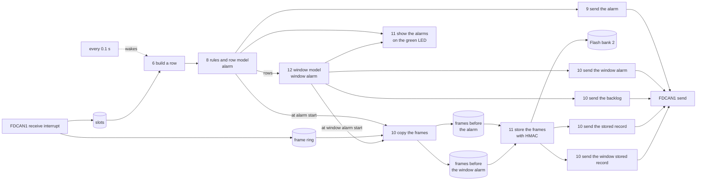

# ai_can_anomaly_detection

The main application on the board. It builds a row from the received frames every
0.1 s and scores it with the rules, the row model and the window model. It sends each
start and end of the alarm and the window alarm on FDCAN1. On rows the alarm rings on,
the window model does not run and the window alarm stays silent. At each start of either
alarm it stores the frames before it in Flash bank 2, with an HMAC. It runs until the board is
reset.

[Prepare, build and flash](#prepare-build-and-flash) builds it, and the [tools](#tools)
send it a log from a PC and read what it sends back.

## Tasks and priorities

The numbers are task priorities. μT-Kernel runs the ready task with the smallest
number first.


```mermaid
flowchart LR
    irq["FDCAN1 receive interrupt"] --> slots[(slots)]
    irq --> ring[(frame ring)]
    tick["every 0.1 s"] -. wakes .-> pre
    slots --> pre["6 build a row"]
    pre --> row["8 rules and row model<br/>alarm"]
    row --> report["9 send the alarm"]
    row -- at alarm start --> copy["10 copy the frames"]
    ring --> copy
    copy --> alarm_frames[(frames before<br/>the alarm)]
    copy --> window_alarm_frames[(frames before<br/>the window alarm)]
    alarm_frames --> store["11 store the frames<br/>with HMAC"]
    window_alarm_frames --> store
    store --> flash[(Flash bank 2)]
    store --> record["10 send the stored record"]
    store --> window_record["10 send the window stored record"]
    row -- rows --> win["12 window model<br/>window alarm"]
    win -- at window alarm start --> copy
    win --> window_report["10 send the window alarm"]
    win --> backlog["10 send the backlog"]
    row --> led["11 show the alarms<br/>on the green LED"]
    win --> led
    report --> bus["FDCAN1 send"]
    window_report --> bus
    backlog --> bus
    record --> bus
    window_record --> bus
```

| priority | task | why it sits there |
|---|---|---|
| 6 | build a row every 0.1 s | every task after it reads the row |
| 8 | score the row with the rules and the row model, raise the alarm | the alarm is decided before the next row |
| 9 | send the alarm | the alarm goes out before anything slower |
| 10 | copy the frames before the alarm or the window alarm, send the window alarm, the backlog and the stored records | the frame ring overwrites frames not yet copied |
| 11 | store the frames in Flash bank 2, show the alarms on the green LED | the frames are kept before the window model runs, and the LED blinks while the window model catches up |
| 12 | score the window with the window model | it is the heaviest, so it gets the time left |

The green LED blinks fast while only the alarm rings and slowly while only the window
alarm rings. It stays on while both ring. Each alarm is shown for 2 s more after it ends.
Both ring at once only until the window model reaches the row the alarm started on.

Frames are received in the interrupt, so no task holds them up. When an alarm starts,
the copy and the store run first and the window model waits. The rows it has not
scored are kept for it, and it catches up after. When it falls further behind than
the rows kept, the oldest are lost, and the backlog frame says how many.

Building the row, both scorings and the copy are described in
[ai_can_anomaly_detection_tasks](../../lib/ai_can_anomaly_detection_tasks/README.md).

## Frames it sends

Every frame is extended, J1939 priority 3, source address 0x80. Numbers are little
endian, and unused bytes are 0xFF.

| frame | ID | sent when | bytes |
|---|---|---|---|
| alarm | 0x0CFF0080 | the alarm starts or ends | 0: 1 for start, 0 for end. 1 to 4: the row number. 5 and 6: the ms from the row's tick to the frame, 0xFFFF for more |
| window alarm | 0x0CFF0180 | the window alarm starts or ends | as the alarm |
| window backlog | 0x0CFF0280 | the window model finished a row after the next row came, or lost rows before it | 0 to 3: the row number. 4 and 5: the rows lost just before it, 0xFFFF for more |
| stored record | 0x0CFF0380 | a record of the alarm is written to Flash | 0 to 3: the row the alarm started on. 4 and 5: the frame count |
| window stored record | 0x0CFF0480 | a record of the window alarm is written to Flash | as the stored record |

The row number counts ticks from when the board started. When a new alarm state comes
while the frame of the one before still waits to be sent, that frame is cancelled.
[board_frames](board_frames.py) turns what the PC received into one line per frame.

## Frames stored in Flash

[store_alarm_frames](../../lib/store_alarm_frames/store_alarm_frames_task.c) writes each
record with [flash_store](../../lib/flash_store/flash_store.h). Erase bank 2 once
before the first run, as [flash.md](../../docs/flash.md#erasing-bank-2-before-first-use)
says. The board prints `flash store init error` and stops when the store cannot start.

Bank 2 is 8 areas of 4 sectors, 32 KB each. Each area holds one record after a 16-byte
header. When every area is used, the oldest is erased. The record, all little endian:

| bytes | value |
|---|---|
| 0 to 3 | the row the alarm started on |
| 4 to 7 | the frame count |
| 8 to 11 | 0 for the alarm, 1 for the window alarm |
| 12 to 15 | 0 |
| 16 to 47 | the HMAC-SHA256 of bytes 0 to 15 and then the frames |
| then 16 per frame, oldest first, up to 2044 | the microseconds since the frame before in 3 bytes, the size in 1 byte, the ID in 4 bytes, the data in 8 bytes, 0 past the size |

The key is in
[alarm_frames_mac_demo_key.h](../../lib/alarm_frames_mac/alarm_frames_mac_demo_key.h).
It is a demo key, so anyone who reads the code can make a valid MAC.

```python
hmac.new(key, record[:16] + record[48:48 + 16 * count], hashlib.sha256).digest()
```

[read_alarm_frames](#read_alarm_frames) prints the records and checks them.

## Models

| model | files | from the runs repository |
|---|---|---|
| row model `nonlinear_ae_k8_h128`, float | [deployed_model](../../lib/deployed_model) | `board/20260930-185248/nonlinear_ae_k8_h128/`, scale of `models/20260927-144150`, threshold of `thresholds/20260929-212110` |
| window model `window_conv1d_ae_r50_s3_k16_h64`, int8 | [deployed_window_model](../../lib/deployed_window_model) | `window_board/20260929-113106/` from `window_quantize/20260929-113012`, scale of `window_models/20260929-082144`, threshold of `window_thresholds/20260929-113151` |

[fetch_model](../../fetch_model.py) writes them. They are kept in git so a clone builds
with nothing fetched. The sample applications use their own copy in
`board/lib/active_model/`.

## Prepare, build and flash

```sh
python3 -m board.prepare ai_can_anomaly_detection
python3 -m board.flash
```

## Tools

Each runs on the PC from the top of the repo.

### fetch

[fetch](fetch.py) downloads the frames of every attacked test log, about 2 GB, into
`fetched/frames/`. No login is needed.

```sh
python3 -m board.application.ai_can_anomaly_detection.fetch
```

| file | holds |
|---|---|
| `frames.parquet` | the frames, with the log each came from in `log` |
| `attacked.json` | the attack put in each log, the log in `log` and the PGN in `pgn` |

The tools below read a log from `frames.parquet` unless `--frames` names another parquet
file with the same columns.

### expected

[expected](expected.py) runs one log through the models the board runs, the ONNX files
its C code was generated from with the same scale and thresholds, and prints the rows
each alarm starts and ends on. Row 1 is 0.1 s after the first frame.

```sh
python3 -m board.application.ai_can_anomaly_detection.expected LOG [--frames FRAMES]
```

```
alarm 0x0CFF0080 start at row 210
alarm 0x0CFF0080 end at row 295
alarm 0x0CFF0180 start at row 201
alarm 0x0CFF0180 end at row 211
```

`0x0CFF0080` is the alarm and `0x0CFF0180` the window alarm. It prints the window alarm
also on rows the alarm rings on, where the board keeps it silent.

### send_test_frames

[send_test_frames](send_test_frames.py) sends one log's frames, each at its time, from a
candleLight gs_usb adapter at 250 kbit/s. On macOS it opens the adapter over USB. On
Linux it sends through a SocketCAN interface already up at 250 kbit/s, `can0` unless
`--interface` names another.

```sh
python3 -m board.application.ai_can_anomaly_detection.send_test_frames LOG [--frames FRAMES] [--interface IFACE] | tee received_frames.txt
```

It prints each frame the board sends to stdout, with the epoch seconds it came, and the
time sending started and at the end what was sent to stderr.

```
received at 1790768485.131  CFF0180   [8]  01 E6 00 00 00 5A 00 FF
sent 50001, echoed 50001, late ms median 0.000, p99 0.000, max 0.639
```

`echoed` counts the frames the adapter handed back as queued. Stop it with Ctrl-C, after
which it closes the adapter. Killed, it leaves the adapter open, and the adapter reads
nothing until plugged in again.

### board_frames

[board_frames](board_frames.py) turns the `received at` lines into one line per frame
the board sent, as the frame means, from a file or from `-` for stdin.

```sh
python3 -m board.application.ai_can_anomaly_detection.send_test_frames LOG | python3 -m board.application.ai_can_anomaly_detection.board_frames -
python3 -m board.application.ai_can_anomaly_detection.board_frames received_frames.txt
```

```
row 230: window alarm start, 90 ms after the row was made
row 230: window alarm frames stored, 178 ms after the window alarm start, 2019 frames
rows 231 to 236: window model late on 6 rows, 0 rows lost
row 239: alarm start, 0 ms after the row was made
```

### read_alarm_frames

[read_alarm_frames](read_alarm_frames.py) prints the records in a copy of bank 2 read
while the board runs, after sending ends as for read_section_cycles, and whether each MAC
matches the demo key. With `--log` it prints where each record's frames are in that log
instead of the frames.

```sh
STM32_Programmer_CLI -c port=SWD mode=HOTPLUG -u 0x08040000 0x40000 bank2.bin
python3 -m board.application.ai_can_anomaly_detection.read_alarm_frames bank2.bin [--log LOG] [--frames FRAMES]
```

```
area 0 sequence 0 window alarm row 230 frames 2019
  the MAC matches the one computed with the key
  matches log frames 14900 to 16918
```

### read_section_cycles

[read_section_cycles](read_section_cycles.py) prints the fewest and most cycles of each
part [section_cycles](../../lib/section_cycles/section_cycles.h) keeps, read over SWD
while the board runs with the `STM32_Programmer_CLI` of `board/paths.json`. Run it
after sending ends. Connected over SWD while frames come, the board stops taking them
until it is reset.

```sh
python3 -m board.application.ai_can_anomaly_detection.read_section_cycles
```

```
core clock 32000000 Hz
receive                             432 to        702 cycles         13.5 to         21.9 us
```

## Results

All on 2026-09-29 but the current, the Release build at `-O2` and 32 MHz, with the
models above.

### Frames and records

The Mac sent `part_3/20210204093505241905.csv`.

With the frames of fewer rows kept, the board wrote one record, for row 629, with 508
frames. Its MAC matched the one computed on the PC, and with one bit of the head or of
the last frame changed it did not. The stored record frame came 45 ms after the alarm
start. Backlog frames came for the alarm's first row and the 5 after it, with no row
lost. The first was scored about 137 ms after its row and the last about 99 ms after.

With the frames of 24 rows kept, the board wrote the record for row 581 into area 0,
with 2041 frames. Its MAC matched, and it matched the log's frames 42838 to 44878, 2.40 s
from 1.46 s before the attack started. The stored record frame came 178 ms after the
alarm start. Backlog frames came for the alarm's first row and the 21 after it, with no
row lost.

In both, the alarm frames went out 0 ms after their tick.

The Mac also sent `part_3/20210204093802472877.csv`, where both alarms start. The board
wrote three records, for the window alarm at row 636 with 2018 frames, for the alarm at
row 646 with 2020 and for the window alarm at row 681 with 2019. Each MAC matched, and
each record matched a run of the log's frames. Each stored record frame came 175 to
179 ms after its alarm start.

### Time of each part

[section_cycles](../../lib/section_cycles/section_cycles.h) keeps the fewest and most
DWT cycles of each part in `section_cycles`, in the order of `Section`.
[read_section_cycles](#read_section_cycles) prints them.

A task's time holds the interrupts and the higher priority tasks that ran inside it. The
receive callback's leaves out the HAL handler and the CPU's interrupt entry and exit.
Both scorings count the tick after the last row too, which only ends the alarms, and
their fewest is that tick.

On 2026-09-30 at `d5ee35a`, from a reset through the Mac sending
`part_3/20210204093901892161.csv` of `test_sets/20260925-203444`:

| part | cycles | us |
|---|---|---|
| receive callback | 432 to 702 | 13.5 to 21.9 |
| cyclic handler | 148 to 218 | 4.6 to 6.8 |
| preprocess, one tick | 98 to 9,213 | 3.1 to 287.9 |
| score and detect by row, one row | 1,700 to 64,788 | 53.1 to 2,024.6 |
| row model inference | 55,663 to 59,333 | 1,739.5 to 1,854.2 |
| score and detect by window, one row | 44 to 8,541,745 | 1.4 to 266,929.5 |
| window model inference | 2,737,404 to 8,460,285 | 85,543.9 to 264,383.9 |
| copy the alarm frames | 199,588 to 200,504 | 6,237.1 to 6,265.8 |
| store the alarm frames | 5,215,005 to 5,226,422 | 162,968.9 to 163,325.7 |
| CAN send | 152 to 991 | 4.8 to 31.0 |
| alarm LED, one step | 531 to 1,457 | 16.6 to 45.5 |

### Size

`arm-none-eabi-size` of the image built from `05d0c87`.

| what | bytes |
|---|---|
| text | 120,588 |
| data | 6,104 |
| bss | 248,116 |

The bss holds the kernel's control blocks in `.noinit`, 9,304 bytes, and the start
stack and heap, 1,536 bytes. The largest objects in it, from the map:

| what | bytes |
|---|---|
| frame ring | 65,548 |
| the alarm frames record in the copy task, the store's two inputs and the store task | 131,092 |
| window model runtime, window task and its input | 38,228 |
| row model runtime | 640 |

The kernel gives the task stacks, the row message buffer and the MAC's memory pool from
the RAM after the bss. The board's RAM was read over SWD while it ran, and the kernel's
areas walked from `knl_imacb`.

| what | bytes |
|---|---|
| 14 areas in use, 12 task stacks, the row message buffer and the MAC pool | 18,800 |
| area headers | 120 |
| free | 6,512 |

Of the 278,528 bytes of RAM, 6,512 are free.

### Current

The STM32H533's current, read on 2026-09-30 with a multimeter in place of the JP2
(IDD) jumper. It is the MCU alone, not the ST-LINK, the LEDs or the CAN parts. With JP2
open the MCU does not start, so all of its supply passes through JP2.

The kernel calls `low_pow` when no task is ready. The first column is before
[0003](../../patches/0003-stm32_cube-sleep-in-low_pow.patch), when it returned at once.
The second is with it, when the CPU sleeps in `wfi` until the next interrupt.

| while | mA, spinning | mA, sleeping |
|---|---|---|
| no frames came | 4.54 | 3.06 |
| the Mac sent `part_3/20210204093802472877.csv` | 4.97 to 5.58 | 3.14 to 3.36 |
