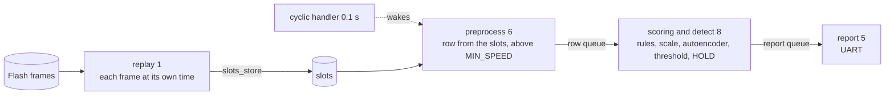

# CAN path from Flash

This application runs the whole path from CAN frames to alarms, with recorded frames
from Flash in place of the bus.



The numbers are task priorities, smaller runs first. The replay task stands in for the
CAN receive interrupt and is the only part that changes when the bus is connected, as
[connecting_can_bus.md](../../docs/connecting_can_bus.md) describes.

## Preprocessing

On each tick preprocessing copies the slots into a row. It sends the row on when a
frame has arrived since the last tick, every PGN has arrived, and the wheel speed is
above `MIN_SPEED`. The row number counts ticks, so a row it does not send leaves a gap
and `HOLD` restarts there. After 1 s with no frame it clears the slots, as
`grid_sample` does across a gap.

A tick with no new frame sends no row, since the row would hold only old values. The
PC holds them across a gap up to 1 s, so there the board sends fewer rows. A J1939 bus
goes 0.1 s without a frame only when it or its senders stop.

## Frames

`replay_frames.h` holds the frames of the log behind the rows of
`rule_check_from_flash/raw_rows.h`, with the same replay attack in. It keeps the PGNs
the board decodes, from 1 s before the first of those rows.

```sh
python3 -m board.replay_frames out data 2 80
```

`out` holds the attack set, `data` the CAN logs, 2 is the attack and 80 the rows.

## Prepare, build and flash

```sh
python3 -m board.prepare CUBEIDE_PROJECT_DIR can_path_from_flash
python3 board/flash.py CUBEIDE_PROJECT_DIR
```
