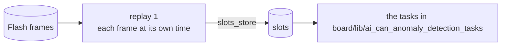

# CAN path from Flash

This application runs the whole path from CAN frames to alarms, with recorded frames
from Flash in place of the bus.


```mermaid
flowchart LR
    frames[(Flash frames)] --> replay["replay 1<br/>each frame at its own time"]
    replay -- slots_store --> slots[(slots)]
    slots --> tasks["the tasks in board/lib/ai_can_anomaly_detection_tasks"]
```

The replay task stands in for the CAN receive interrupt and is the only part that
changes when the bus is connected, as
[connecting_can_bus.md](../../docs/connecting_can_bus.md) describes. The tasks after the
slots are described in [their README](../../lib/ai_can_anomaly_detection_tasks/README.md).

## Frames

`replay_frames.h` holds the frames of the log behind the rows of
`rule_check_from_flash/raw_rows.h`, with the same replay attack in. It keeps the PGNs
the board decodes, from 1 s before the first of those rows.

## Prepare, build and flash

```sh
python3 -m board.prepare CUBEIDE_PROJECT_DIR can_path_from_flash
python3 board/flash.py CUBEIDE_PROJECT_DIR
```
