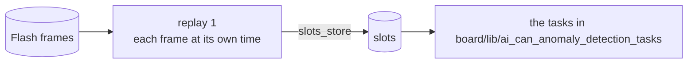

# CAN path from Flash

This application runs the whole path from CAN frames to alarms, with recorded frames
from Flash in place of the bus.


```mermaid
flowchart LR
    frames[(Flash frames)] --> replay["replay 1<br/>each frame at its own time"]
    replay -- slots_store --> slots[(slots)]
    slots --> tasks["the tasks in board/lib/ai_can_anomaly_detection_tasks"]
```

The replay task stands in for the CAN receive interrupt and is the only part that
changes when the bus is connected, as
[connecting_can_bus.md](../../docs/connecting_can_bus.md) describes. The tasks after the
slots are described in [their README](../../lib/ai_can_anomaly_detection_tasks/README.md).

## Frames

`replay_frames.h` holds the frames of the log behind the rows of
`rule_check_from_flash/raw_rows.h`, with the same replay attack in. It keeps the PGNs
the board decodes, from 1 s before the first of those rows.

## Prepare, build and flash

```sh
python3 -m board.prepare CUBEIDE_PROJECT_DIR can_path_from_flash
python3 board/flash.py CUBEIDE_PROJECT_DIR
```

## Check on the board

This application runs `nonlinear_ae_k8_h64` from
[`board/lib/active_model/`](../../lib/active_model). `ai_can_anomaly_detection` runs a
larger model.

[expected.py](expected.py) gives the rows the alarm should start and end on. It sends
the frames of `replay_frames.h` through the same steps on the PC. It builds a row every
0.1 s, runs the rules and the model, and raises an alarm when 10 of the last 10 rows
are flagged by a rule or by the model. It numbers the rows from the first frame, one
every 0.1 s, as the board does.

Run it from the repository root. It runs the float ONNX file in
`board/lib/active_model/`.

```sh
python3 -m board.application.can_path_from_flash.expected
```

On 2026-09-28 it printed:

```
rows: 88, from row 1 to row 88, moving 88, segments 1
rule hits 60, above the threshold 60
alarm start at row 29
alarm end at row 80
```

The board should print the last two lines.
