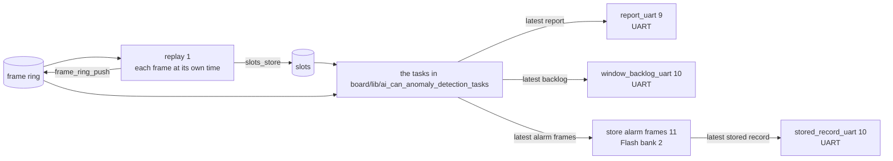

# CAN path from Flash

This application runs the whole path from CAN frames to alarms, with recorded frames
from Flash in place of the bus.


```mermaid
flowchart LR
    frames[(Flash frames)] --> replay["replay 1<br/>each frame at its own time"]
    replay -- slots_store --> slots[(slots)]
    replay -- frame_ring_push --> frames[(frame ring)]
    slots --> tasks["the tasks in board/lib/ai_can_anomaly_detection_tasks"]
    frames --> tasks
    tasks -- latest report --> uart["report_uart 9<br/>UART"]
    tasks -- latest backlog --> backlog_uart["window_backlog_uart 10<br/>UART"]
    tasks -- latest alarm frames --> store["store alarm frames 11<br/>Flash bank 2"]
    store -- latest stored record --> record_uart["stored_record_uart 10<br/>UART"]
```

The replay task stands in for the CAN receive interrupt. At each start of the alarm or
the window alarm the frames behind it go to Flash bank 2, as in
[ai_can_anomaly_detection](../ai_can_anomaly_detection/README.md#frames-stored-in-flash). With no bus, the alarms go
over UART from [report_uart](../../lib/report_uart/report_uart_task.c) at priority 9. The tasks after the
slots are described in [their README](../../lib/ai_can_anomaly_detection_tasks/README.md).

## Frames

`replay_frames.h` holds the frames of `part_3/20210204093802472877.csv`, with its
replay attack in, as `ai_can_anomaly_detection/fetched/frames` holds it. It keeps the
PGNs the board decodes, from 42.4 s to 56.0 s after the log's first frame. The attack
starts at 49.4 s, so the window model has 50 rows before it.

## Prepare, build and flash

```sh
python3 -m board.prepare CUBEIDE_PROJECT_DIR can_path_from_flash
python3 board/flash.py CUBEIDE_PROJECT_DIR
```

## Check on the board

This application runs `nonlinear_ae_k8_h64` from
[`board/lib/active_model/`](../../lib/active_model). `ai_can_anomaly_detection` runs a
larger model.

[expected.py](expected.py) gives the rows the alarm and the window alarm should start
and end on. It sends
the frames of `replay_frames.h` through the same steps on the PC. It builds a row every
0.1 s, runs the rules and the model, and raises an alarm when 10 of the last 10 rows
are flagged by a rule or by the model. It numbers the rows from the first frame, one
every 0.1 s, as the board does.

Run it from the repository root. It runs the float ONNX file in
`board/lib/active_model/`.

```sh
python3 -m board.application.can_path_from_flash.expected
```

The window alarm runs the window model's int8 ONNX file in
`board/lib/deployed_window_model/` on the moving rows, as `score_and_detect_by_window`
does. On 2026-09-29 it printed:

```
rows: 135, from row 1 to row 135, moving 135, segments 1
rule hits 45, above the threshold 0
alarm 0x0CFF0080 start at row 79
alarm 0x0CFF0080 end at row 115
alarm 0x0CFF0180 start at row 70
alarm 0x0CFF0180 end at row 80
alarm 0x0CFF0180 start at row 115
alarm 0x0CFF0180 end at row 125
```

The window alarm starts 9 rows before the alarm. The board should print the six alarm
lines, the two alarms' lines mixed in the order they happen, and a stored record line
after each start. After the replay it prints
the fewest and most cycles one push into the frame ring took, and the core clock. An
interrupt during a push adds to it. On 2026-09-29 the Release build, at `-O2`, printed

```
alarm 0x0CFF0180 start at row 70, 90 ms after its tick
stored 0x0CFF0480 record of row 70 with 792 frames
backlog 0x0CFF0280 at row 71, 0 rows lost before it
backlog 0x0CFF0280 at row 72, 0 rows lost before it
backlog 0x0CFF0280 at row 73, 0 rows lost before it
backlog 0x0CFF0280 at row 74, 0 rows lost before it
backlog 0x0CFF0280 at row 75, 0 rows lost before it
backlog 0x0CFF0280 at row 76, 0 rows lost before it
backlog 0x0CFF0280 at row 77, 0 rows lost before it
alarm 0x0CFF0080 start at row 79, 0 ms after its tick
stored 0x0CFF0380 record of row 79 with 792 frames
backlog 0x0CFF0280 at row 78, 0 rows lost before it
backlog 0x0CFF0280 at row 79, 0 rows lost before it
backlog 0x0CFF0280 at row 80, 0 rows lost before it
alarm 0x0CFF0180 end at row 80, 210 ms after its tick
backlog 0x0CFF0280 at row 81, 0 rows lost before it
backlog 0x0CFF0280 at row 82, 0 rows lost before it
backlog 0x0CFF0280 at row 83, 0 rows lost before it
backlog 0x0CFF0280 at row 84, 0 rows lost before it
backlog 0x0CFF0280 at row 85, 0 rows lost before it
backlog 0x0CFF0280 at row 86, 0 rows lost before it
backlog 0x0CFF0280 at row 87, 0 rows lost before it
backlog 0x0CFF0280 at row 88, 0 rows lost before it
backlog 0x0CFF0280 at row 89, 0 rows lost before it
backlog 0x0CFF0280 at row 90, 0 rows lost before it
backlog 0x0CFF0280 at row 91, 0 rows lost before it
backlog 0x0CFF0280 at row 92, 0 rows lost before it
backlog 0x0CFF0280 at row 93, 0 rows lost before it
backlog 0x0CFF0280 at row 94, 0 rows lost before it
backlog 0x0CFF0280 at row 95, 0 rows lost before it
backlog 0x0CFF0280 at row 96, 0 rows lost before it
backlog 0x0CFF0280 at row 97, 0 rows lost before it
backlog 0x0CFF0280 at row 98, 0 rows lost before it
backlog 0x0CFF0280 at row 99, 0 rows lost before it
backlog 0x0CFF0280 at row 100, 0 rows lost before it
backlog 0x0CFF0280 at row 101, 0 rows lost before it
backlog 0x0CFF0280 at row 102, 0 rows lost before it
backlog 0x0CFF0280 at row 103, 0 rows lost before it
backlog 0x0CFF0280 at row 104, 0 rows lost before it
backlog 0x0CFF0280 at row 105, 0 rows lost before it
alarm 0x0CFF0080 end at row 115, 0 ms after its tick
alarm 0x0CFF0180 start at row 115, 90 ms after its tick
stored 0x0CFF0480 record of row 115 with 792 frames
backlog 0x0CFF0280 at row 116, 0 rows lost before it
backlog 0x0CFF0280 at row 117, 0 rows lost before it
backlog 0x0CFF0280 at row 118, 0 rows lost before it
backlog 0x0CFF0280 at row 119, 0 rows lost before it
backlog 0x0CFF0280 at row 120, 0 rows lost before it
backlog 0x0CFF0280 at row 121, 0 rows lost before it
backlog 0x0CFF0280 at row 122, 0 rows lost before it
backlog 0x0CFF0280 at row 123, 0 rows lost before it
backlog 0x0CFF0280 at row 124, 0 rows lost before it
backlog 0x0CFF0280 at row 125, 0 rows lost before it
alarm 0x0CFF0180 end at row 125, 130 ms after its tick
backlog 0x0CFF0280 at row 126, 0 rows lost before it
backlog 0x0CFF0280 at row 127, 0 rows lost before it
backlog 0x0CFF0280 at row 128, 0 rows lost before it
backlog 0x0CFF0280 at row 129, 0 rows lost before it
backlog 0x0CFF0280 at row 130, 0 rows lost before it
backlog 0x0CFF0280 at row 131, 0 rows lost before it
backlog 0x0CFF0280 at row 132, 0 rows lost before it
backlog 0x0CFF0280 at row 133, 0 rows lost before it
frame ring push 87 to 136 cycles at 32000000 Hz
```

Bank 2 then holds three records, for the window alarm at row 70, the alarm at row 79
and the window alarm at row 115, each with 792 frames, the frames of the 24 rows before
the start. Their MACs matched the one computed on the PC, as
[ai_can_anomaly_detection](../ai_can_anomaly_detection/README.md#frames-stored-in-flash)
describes.
