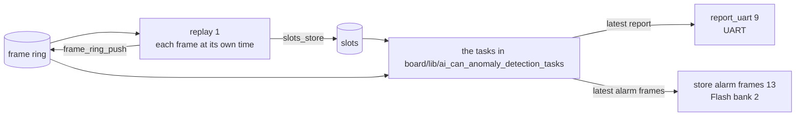

# CAN path from Flash

This application runs the whole path from CAN frames to alarms, with recorded frames
from Flash in place of the bus.


```mermaid
flowchart LR
    frames[(Flash frames)] --> replay["replay 1<br/>each frame at its own time"]
    replay -- slots_store --> slots[(slots)]
    replay -- frame_ring_push --> frames[(frame ring)]
    slots --> tasks["the tasks in board/lib/ai_can_anomaly_detection_tasks"]
    frames --> tasks
    tasks -- latest report --> uart["report_uart 9<br/>UART"]
    tasks -- latest alarm frames --> store["store alarm frames 13<br/>Flash bank 2"]
```

The replay task stands in for the CAN receive interrupt. At each alarm start the
frames behind it go to Flash bank 2, as in
[ai_can_anomaly_detection](../ai_can_anomaly_detection/README.md#the-alarm-frames-in-flash). With no bus, the alarms go
over UART from [report_uart](../../lib/report_uart/report_uart_task.c) at priority 9. The tasks after the
slots are described in [their README](../../lib/ai_can_anomaly_detection_tasks/README.md).

## Frames

`replay_frames.h` holds the frames of the log behind the rows of
`rule_check_from_flash/raw_rows.h`, with the same replay attack in. It keeps the PGNs
the board decodes, from 1 s before the first of those rows.

## Prepare, build and flash

```sh
python3 -m board.prepare CUBEIDE_PROJECT_DIR can_path_from_flash
python3 board/flash.py CUBEIDE_PROJECT_DIR
```

## Check on the board

This application runs `nonlinear_ae_k8_h64` from
[`board/lib/active_model/`](../../lib/active_model). `ai_can_anomaly_detection` runs a
larger model.

[expected.py](expected.py) gives the rows the alarm and the window alarm should start
and end on. It sends
the frames of `replay_frames.h` through the same steps on the PC. It builds a row every
0.1 s, runs the rules and the model, and raises an alarm when 10 of the last 10 rows
are flagged by a rule or by the model. It numbers the rows from the first frame, one
every 0.1 s, as the board does.

Run it from the repository root. It runs the float ONNX file in
`board/lib/active_model/`.

```sh
python3 -m board.application.can_path_from_flash.expected
```

The window alarm runs the window model's int8 ONNX file in
`board/lib/deployed_window_model/` on the moving rows, as `score_and_detect_by_window`
does. On 2026-09-29 it printed:

```
rows: 88, from row 1 to row 88, moving 88, segments 1
rule hits 60, above the threshold 60
alarm 0x0CFF0080 start at row 29
alarm 0x0CFF0080 end at row 80
alarm 0x0CFF0180 start at row 20
alarm 0x0CFF0180 end at row 30
alarm 0x0CFF0180 start at row 80
```

The board should print the five alarm lines, the two alarms' lines mixed in the order
they happen. After the replay it prints the fewest and
most cycles one push into the frame ring took, and the core clock. An interrupt during
a push adds to it. On 2026-09-29 the Release build, at `-O2`, printed

```
frame ring push 87 to 133 cycles at 32000000 Hz
```

Bank 2 then holds one record, for row 29. On 2026-09-29 it held 330 frames. Its MAC
matched the one computed on the PC, as
[ai_can_anomaly_detection](../ai_can_anomaly_detection/README.md#the-alarm-frames-in-flash)
describes. With one bit of the head or of the last frame changed, it did not.

## Load

[load](../../lib/load/load_task.c) is a synthetic load that stands in for the work an
ECU has besides detection. It runs at priority 11, below the copy of the alarm frames
and above score and detect by window. Every `LOAD_PERIOD` ms it runs a CRC-32 over 64
bytes `LOAD_UNITS` times. Both are in [usermain.c](usermain.c). `LOAD_UNITS` is 0, so
the load does nothing until it is set. A wake that comes while it works makes it run
again at once. Before the tasks start the board prints what one wake takes, such as

```
load 80 units 297592 cycles every 10 ms at 32000000 Hz
```

One unit took 3,752 cycles, 1.17% of a 10 ms period at 32 MHz. A load that comes now
and then is a long period with many units.

On 2026-09-29 with 80 units every 10 ms, about 93% of the CPU, the board printed the
same alarm lines and frame ring push cycles as with none.
