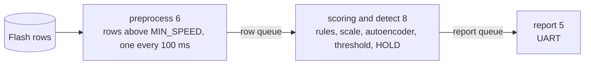

# Scoring and detect from Flash

This application scores the physical rows of `rule_check_from_flash/raw_rows.h` and
detects on them.



The numbers are task priorities, smaller runs first. The scoring and detect task flags a
row a rule hits or whose score is above `THRESHOLD_SCORE`, and reports the row that
completes `HOLD` flagged rows in a row and the row the run ends on.

A row below `MIN_SPEED` is never sent, so the row numbers have gaps in them and the run
of flagged rows restarts there, as a new segment does on the PC.

`HOLD` is 10 rows, one of the two values the PC reports every detector at.

## Threshold

`board/lib/active_model/threshold.h` holds the threshold `calibrate` took for the
active model, written by hand as the exact bits of the float32. It is placed with the
model files of `board/lib/active_model/` and changes with them.

## Prepare, build and flash

```sh
python3 -m board.prepare CUBEIDE_PROJECT_DIR scoring_and_detect_from_flash
python3 board/flash.py CUBEIDE_PROJECT_DIR
```
