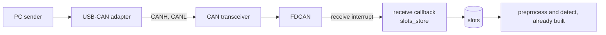

# Connecting the CAN bus

This page is for whoever brings real CAN frames onto the board. The detector already
runs on the board from CAN frames to alarms, in
[`can_path_from_flash`](../application/can_path_from_flash/README.md), with recorded
frames from Flash in place of the bus. Only the part that feeds it frames is missing.



Everything left of `slots` is the CAN side's.

## What the CAN side builds

| part | what it is | state |
|---|---|---|
| FDCAN in CubeMX | FDCAN1 in `ai_can_detection.ioc`, classic CAN at 250 kbit/s, extended IDs, the RX FIFO 0 new message interrupt, a filter that accepts every frame | not enabled in the `.ioc` |
| receive callback | takes each frame out of the FIFO and calls `slots_store`, see below | not written |
| wiring | FDCAN TX and RX pins to a 3.3 V transceiver module, CANH and CANL to the USB-CAN adapter, 120 Ω at both ends of the bus, a common ground | not built |
| PC sender | sends frames through the USB-CAN adapter at their own timestamps | none in this repository |

The recorded bus is SAE J1939, 250 kbit/s, extended 29-bit IDs, as
[can_data.md](../../can_data/can_data.md#source) describes. The FDCAN kernel clock in
the `.ioc` is 25 MHz today. A lower system clock later changes the bit timing, so the
clock settings are agreed between the two sides.

The hardware on hand is a DSD TECH SH-C31A USB-CAN adapter and a 3.3 V CAN transceiver
module. How the PC talks to the adapter is left to the CAN side.

## Connecting the receive callback

The bus gets its own application, `board/application/can_path/`, copied from
`can_path_from_flash`. The replay application stays as it is, so the path can still be
checked without a bus. Its replay task calls `slots_store` for each frame at the
frame's own time. In `can_path` the FDCAN receive callback makes the same call and the
replay task goes.

```c
IMPORT Slots bus;

void HAL_FDCAN_RxFifo0Callback(FDCAN_HandleTypeDef *hfdcan, uint32_t RxFifo0ITs)
{
	FDCAN_RxHeaderTypeDef header;
	uint8_t data[8];

	while(HAL_FDCAN_GetRxMessage(hfdcan, FDCAN_RX_FIFO0, &header, data) == HAL_OK) {
		if(header.IdType == FDCAN_EXTENDED_ID) {
			slots_store(&bus, header.Identifier, data, size, time);
		}
	}
}
```

| argument | what to pass |
|---|---|
| `&bus` | the `Slots` that `usermain.c` exports |
| `arb_id` | the 29-bit extended ID |
| `data` | the payload |
| `size` | payload bytes, converted from the header's `DataLength` code |
| `time` | the receive time in the driver's own clock, e.g. the FDCAN timestamp or the DWT cycle counter |

`size` and `time` are left to the CAN side in the sketch above. Nothing reads `time`
yet. The kernel tick is 10 ms, too coarse for it.

In the copied `usermain` the replay task is no longer created or started. Remove `replay_ctsk`,
the `tk_cre_tsk` and `tk_sta_tsk` of `replay`, `replay_task` and the
`replay_frames.h` include. `replay_done` then stays 0 and preprocessing runs until
reset, instead of stopping 1 s after the last Flash frame.

Frames the FDCAN FIFO lost should be counted by the driver, so a report can say the
board did not see the whole bus. Nothing reports that count yet.

## FDCAN interrupt priority

Preprocessing copies the slots one at a time between `DI` and `EI`, so the receive
interrupt never meets a half written slot. That holds only if `DI` masks the FDCAN
interrupt.

In the STM32H5 port `DI` raises BASEPRI to `INTPRI_MAX_EXTINT_PRI`, which is 1 in
`mtk3_bsp2/include/sys/sysdepend/stm32_cube/cpu/stm32h5/sysdef.h`. `DI` therefore masks
interrupts of priority 1 to 15 and leaves priority 0 running. CubeMX gives a new
interrupt priority 0.

Set `FDCAN1_IT0_IRQn` to preemption priority 1 or above in CubeMX, under System Core,
NVIC. At 0 the callback can overwrite a slot while preprocessing copies it. This is
read from the port's source and not yet checked on the board.

## Fetching frames and models

Frames to send can be fetched from the dataset repository on Hugging Face,
`asana17/ai_can_anomaly_detection_data`, which needs no login. A test set holds its
logs with the attacks injected, frame by frame, as Parquet files under `frames/`. Their
columns are in [injected_frames](../../assemble/docs/injected_frames.md). Today the
repository holds one older export at its top level.

```sh
hf download asana17/ai_can_anomaly_detection_data frames/frames.parquet frames/attacked.json \
  --repo-type dataset --local-dir out
```

The CAN logs themselves, normal traffic with no attack, come from the Turku dataset as
[can_data.md](../../can_data/can_data.md#getting-it) describes.

The model C the board builds with is already in `board/lib/active_model/`. It came from
`board/20260916-232708/` in the runs repository `asana17/ai_can_anomaly_detection_runs`,
and can be fetched again from there.

```sh
hf download asana17/ai_can_anomaly_detection_runs --include "board/20260916-232708/*" \
  --local-dir runs
```

## Checking it

Prepare, build and flash `can_path` as `can_path_from_flash` is, then read the UART on the
ST-LINK virtual COM port while the PC sends. [setup.md](setup.md) and
[flash.md](flash.md) give the steps.
