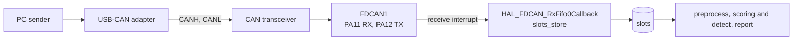

# Connecting the CAN bus

This page is for whoever brings real CAN frames onto the board.

FDCAN1 is enabled in the CubeMX project, and
[`ai_can_anomaly_detection`](../application/ai_can_anomaly_detection/README.md) starts
it and stores every frame it receives in the slots. It builds. It has not run on the
board, and no frame has reached it. The bus is not wired, and nothing on the PC sends.



## What is left

| part | what it is | state |
|---|---|---|
| wiring | PA11 and PA12 to a 3.3 V transceiver module, CANH and CANL to the USB-CAN adapter, 120 Ω at both ends of the bus, a common ground | not built |
| PC sender | sends frames through the USB-CAN adapter at their own timestamps | none in this repository |
| first run | flash the application and see alarms while the PC sends | not done |

The hardware on hand is a DSD TECH SH-C31A USB-CAN adapter and a 3.3 V CAN transceiver
module. How the PC talks to the adapter is left open.

## FDCAN1 in CubeMX

The settings are in [`board/cubemx/ai_can_detection.ioc`](../cubemx/ai_can_detection.ioc).

| setting | value |
|---|---|
| pins | PA11 RX, PA12 TX |
| frame format | classic CAN, normal mode |
| kernel clock | 86 MHz, PLL1Q from CSI. SYSCLK stays at 32 MHz from HSI |
| bit timing | prescaler 4, seg1 74, seg2 11, SJW 11, which is 250 kbit/s with the sample point at 87.2% |
| filters | none. `can_start` in the application accepts every frame into RX FIFO 0 |
| interrupt | `FDCAN1_IT0_IRQn` at preemption priority 1 |

The recorded bus is SAE J1939, 250 kbit/s, extended 29-bit IDs, as
[can_data.md](../../can_data/can_data.md#source) describes. The bit timing holds only
at an 86 MHz kernel clock. A change to the clock tree changes it.

PLL1 runs only for FDCAN. It draws current the board did not draw before, which the
current measurement will include.

## The receive callback

`usermain.c` of the application starts FDCAN1 and holds the callback.

- `can_start` accepts every standard and extended frame into RX FIFO 0, rejects remote
  frames, turns on the new message interrupt and starts FDCAN1. `usermain` calls it
  last, once the tasks and the tick are running.
- `HAL_FDCAN_RxFifo0Callback` empties the FIFO and calls `slots_store` for each frame
  with a 29-bit ID. A DLC above 8 counts as 8 bytes, as classic CAN defines it. The
  receive time is the DWT cycle counter, which `model_init` turns on. Nothing reads the
  time yet.

RX FIFO 0 holds 3 frames, `SRAMCAN_RF0_NBR` in the H5 HAL. Frames it loses are not
counted yet.

## Interrupt priority

Preprocessing copies the slots one at a time between `DI` and `EI`, so the receive
interrupt never meets a half written slot. That holds only if `DI` masks the FDCAN
interrupt.

In the STM32H5 port `DI` raises BASEPRI to `INTPRI_MAX_EXTINT_PRI`, which is 1 in
`mtk3_bsp2/include/sys/sysdepend/stm32_cube/cpu/stm32h5/sysdef.h`. `DI` therefore masks
interrupts of priority 1 to 15 and leaves priority 0 running. `FDCAN1_IT0_IRQn` is at 1.
This is read from the port's source and not yet checked on the board.

`tm_printf` masks the same interrupts while it sends each character, about 87 µs at
115200 bps, and 174 µs for a line end, computed, not measured. A classic frame with
8 bytes takes about 0.5 ms at 250 kbit/s, so the FIFO holds what arrives meanwhile.

## Fetching the frames to send

The frames for the PC to send are in a test set of the dataset repository on Hugging
Face, `asana17/ai_can_anomaly_detection_data`, which needs no login. A test set holds
its logs with the attacks injected, frame by frame, as Parquet files under `frames/`,
and which attack each log holds in `injected.json`. Their columns are in
[injected_frames](../../assemble/docs/injected_frames.md).

The CAN logs themselves, normal traffic with no attack, come from the Turku dataset as
[can_data.md](../../can_data/can_data.md#getting-it) describes.

## Checking it

Prepare, build and flash, then read the UART on the ST-LINK virtual COM port while the
PC sends. [setup.md](setup.md) and [flash.md](flash.md) give the steps.

```sh
python3 -m board.prepare CUBEIDE_PROJECT_DIR ai_can_anomaly_detection
python3 board/flash.py CUBEIDE_PROJECT_DIR
```

The first line names the model and says FDCAN1 is being read. `FDCAN start error` in
its place means FDCAN1 did not start. An alarm line appears only when a replayed
attack reaches rows above `MIN_SPEED`.
