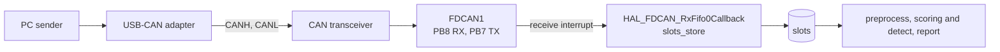

# Connecting the CAN bus

This page is for whoever brings real CAN frames onto the board.

FDCAN1 is enabled in the CubeMX project, and
[`ai_can_anomaly_detection`](../application/ai_can_anomaly_detection/README.md) starts
it and stores every frame it receives in the slots. The bus is wired, and
[can_bus_debug](../application/can_bus_debug/README.md) has sent and received frames
over it.


```mermaid
flowchart LR
    pc[PC sender] --> usb[USB-CAN adapter] -- CANH, CANL --> tr[CAN transceiver] --> fd["FDCAN1<br/>PB8 RX, PB7 TX"]
    fd -- receive interrupt --> cb["HAL_FDCAN_RxFifo0Callback<br/>slots_store"]
    cb --> slots[(slots)]
    slots --> pre[preprocess, scoring and detect, report]
```

## What is left

| part | what it is | state |
|---|---|---|
| wiring | PB8 and PB7 to an MCP2562FD transceiver, CANH and CANL to the USB-CAN adapter, 120 Ω at both ends of the bus, a common ground | built |
| PC sender | sends frames through the USB-CAN adapter at their own timestamps | [`send_test_frames.py`](../application/ai_can_anomaly_detection/send_test_frames.py), on macOS |
| first run | flash the application and see alarms while the PC sends | [done](#checking-it) |

The hardware on hand is a DSD TECH SH-C31A USB-CAN adapter and a Microchip
MCP2562FD-E/P CAN transceiver. Its VDD takes 5 V and its VIO takes the 3.3 V of the
board. [can_bus_debug](../application/can_bus_debug/README.md#wiring) gives its pins.

The adapter runs the candleLight firmware. It shows up on USB as `canable2 gs_usb`,
VID 0x1d50 and PID 0x606f, and has no serial port.

### On macOS

macOS has no driver for the adapter, so Python drives it over USB with `pyusb` and
`gs_usb`. It needs libusb from Homebrew.

```sh
brew install libusb
python3 -m pip install --user pyusb gs_usb
```

[`send_test_frames.py`](../application/ai_can_anomaly_detection/send_test_frames.py)
opens the adapter this way. Each point below failed on the Mac without it.

- pyusb finds no libusb by itself. The script loads
  `/opt/homebrew/lib/libusb-1.0.dylib` by its path.
- python-can's `gs_usb` interface finds no bit timing for 250 kbit/s. The script sets it
  with `GsUsb.set_timing(prop_seg=1, phase_seg1=57, phase_seg2=9, sjw=9, brp=10)`, for
  the adapter's 170 MHz clock.
- `GsUsb.start` asks whether a kernel driver holds the adapter, and macOS denies the
  question. The script answers it with no.
- After `GsUsb.stop` the script calls `usb.util.dispose_resources`. Without it the next
  open reads nothing until the adapter is plugged in again. A USB reset does not help.

The adapter hands back each frame it has queued. That does not mean a node acknowledged
it.

### On Ubuntu

Linux drives the adapter with its `gs_usb` driver as a SocketCAN interface. With
`can-utils` installed, this brings it up at the bus's bit rate and shows every frame:

```sh
sudo ip link set can0 type can bitrate 250000 sample-point 0.875
sudo ip link set can0 up
candump -t d -e can0
```

`cansend can0 18FEF200#1111111111111111` sends one frame.
`ip -details -statistics link show can0` shows the adapter's error counts and bus state.

## FDCAN1 in CubeMX

The settings are in [`board/cubemx/ai_can_detection.ioc`](../cubemx/ai_can_detection.ioc).

| setting | value |
|---|---|
| pins | PB8 RX, PB7 TX |
| frame format | classic CAN, normal mode |
| kernel clock | 32 MHz, PLL1Q from CSI, with N 128 and Q 16. SYSCLK and APB1 stay at 32 MHz from HSI |
| bit timing | prescaler 2, seg1 55, seg2 8, SJW 8, which is 250 kbit/s with the sample point at 87.5% |
| automatic retransmission | on. A frame that loses arbitration or meets an error is sent again |
| filters | none. `can_start` in the application accepts every frame into RX FIFO 0 |
| interrupt | `FDCAN1_IT0_IRQn` at preemption priority 1 |

The recorded bus is SAE J1939, 250 kbit/s, extended 29-bit IDs, as
[can_data.md](../../can_data/can_data.md#source) describes. The bit timing holds only
at a 32 MHz kernel clock. A change to the clock tree changes it.

A kernel clock faster than APB1 loses frames. With the kernel clock at 86 MHz and APB1
at 32 MHz, FDCAN1 acknowledged every frame on the bus but failed to write some of them
into its message RAM. It set the message RAM access failure flag and dropped them. On
2026-09-28 it dropped 11 of 25 frames that way. At 32 MHz it received all 25.

PLL1 runs only for FDCAN. It draws current the board did not draw before, which the
current measurement will include.

## The receive callback

`usermain.c` of the application starts FDCAN1 and holds the callback.

- `can_start` accepts every standard and extended frame into RX FIFO 0, rejects remote
  frames, turns on the new message interrupt and starts FDCAN1. `usermain` calls it
  last, once the tasks and the tick are running.
- `HAL_FDCAN_RxFifo0Callback` empties the FIFO and calls `slots_store` for each frame
  with a 29-bit ID. A DLC above 8 counts as 8 bytes, as classic CAN defines it. The
  receive time is the DWT cycle counter, which `model_init` turns on. Nothing reads the
  time yet.

RX FIFO 0 holds 3 frames, `SRAMCAN_RF0_NBR` in the H5 HAL. Frames it loses are not
counted yet.

## Interrupt priority

Preprocessing copies the slots one at a time between `DI` and `EI`, so the receive
interrupt never meets a half written slot. That holds only if `DI` masks the FDCAN
interrupt.

In the STM32H5 port `DI` raises BASEPRI to `INTPRI_MAX_EXTINT_PRI`, which is 1 in
`mtk3_bsp2/include/sys/sysdepend/stm32_cube/cpu/stm32h5/sysdef.h`. `DI` therefore masks
interrupts of priority 1 to 15 and leaves priority 0 running. `FDCAN1_IT0_IRQn` is at 1.
This is read from the port's source and not yet checked on the board.

`tm_printf` masks the same interrupts while it sends each character, about 87 µs at
115200 bps, and 174 µs for a line end, computed, not measured. A classic frame with
8 bytes takes about 0.5 ms at 250 kbit/s, so the FIFO holds what arrives meanwhile.

## Fetching the frames to send

The frames to send are attacked test frames. They are in the dataset repository on
Hugging Face, `asana17/ai_can_anomaly_detection_data`, which needs no login, as
`frames/frames.parquet` with each log's attack in `frames/attacked.json`. The PC answer
runs the float model in `board/lib/deployed_model/`, the one the board's C was generated
from.

```sh
python3 -m board.application.ai_can_anomaly_detection.fetch
```

This downloads them, pinned to a commit, into
`board/application/ai_can_anomaly_detection/fetched/`. The frames take about 2 GB.
Each log holds about a minute of frames. The columns are in
[injected_frames](../../assemble/docs/injected_frames.md).

The CAN logs themselves, normal traffic with no attack, come from the Turku dataset as
[can_data.md](../../can_data/can_data.md#getting-it) describes.

## Checking it

Prepare, build and flash. [setup.md](setup.md) and [flash.md](flash.md) give the steps.

```sh
python3 -m board.prepare CUBEIDE_PROJECT_DIR ai_can_anomaly_detection
python3 board/flash.py CUBEIDE_PROJECT_DIR
```

Open the ST-LINK virtual COM port at 115200 bps. The board prints `reading FDCAN1`.
`FDCAN start error` after it means FDCAN1 did not start. The alarms go out on CAN, not
over UART.

Pick a log from `attacked.json`, print the PC answer for it, and send it:

```sh
python3 -m board.application.ai_can_anomaly_detection.expected part_3/20210204093505241905.csv
python3 -m board.application.ai_can_anomaly_detection.send_test_frames part_3/20210204093505241905.csv
```

`expected` prints the rows the alarm starts and ends on, counted from when sending
starts. `send_test_frames` prints each frame the board sends, such as

```
received at 1790602535.128  CFF0080   [8]  01 82 02 00 00 FF FF FF
```

The fields are in
[the application's README](../application/ai_can_anomaly_detection/README.md#the-alarm-frame).
The board's rows count from when it started. So they are the PC's plus one offset, the
rows between start and sending. The offset is found from the first alarm, and the other
rows are checked against it. A row can differ by one, since the board's tick is not in
step with the start of sending. [can_path_from_flash](../application/can_path_from_flash/README.md)
feeds the same frames each time and is the exact check.

On 2026-09-28 `part_3/20210204094457960567.csv` gave all three alarms as frames, at an
offset of 92 rows. The second alarm ended one row after the PC answer, and the other
rows matched. In an earlier sending of two logs, over about 1,000 s, the board's tick
ran about 0.3% faster than the Mac's clock, so an offset taken in one sending does not
hold for the next.
