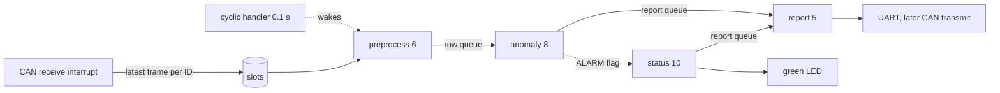
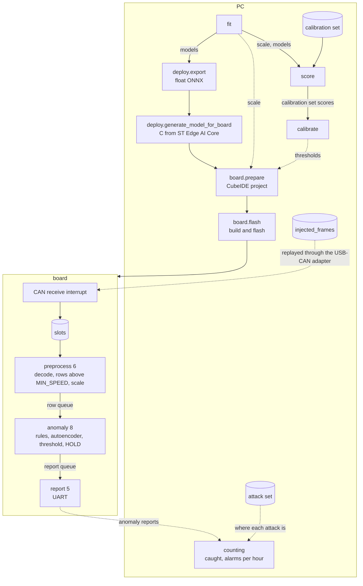

# Board goal

What the board application is meant to become, and the order it is built in. It is our
entry to the [TRON Programming Contest 2026](https://www.tron.org/ja/programming_contest-2026/),
RTOS application category, due 2026-09-30 18:00.

The [rules](https://www.tron.org/ja/programming_contest-2026/programming_contest_entry-2026/rules-2026/)
score usefulness, practicality, originality and future potential. They rate real-time
performance, low power and small footprint highly, and the theme is AI combined with
μT-Kernel 3.0, where a closer tie to the kernel scores higher. Publishing the source as
open source adds points. Judges must be able to run the entry from our instructions, or
it is not judged.

Our case is substance shown by measurement, not a demo feature. The detector is a real
one evaluated on real truck CAN logs, and each RTOS property the rules name gets a
number measured on the board.

## Structure

The numbers are task priorities, smaller runs first.

| part | what it does | when its output is full |
|---|---|---|
| CAN receive interrupt | overwrites the slot of the frame's ID with its raw bytes and receive time | nothing to fill |
| cyclic handler | wakes preprocess every 0.1 s | |
| report 5 | sends each report out, the only part that touches UART or CAN transmit | UART, see below |
| preprocess 6 | copies the slots, decodes and scales them into one numbered row, sent only above `MIN_SPEED` | drops the oldest row and counts it |
| anomaly 8 | runs the rules and the autoencoder on each row, holds a flag over `HOLD` rows, reports anomalies | waits for the report queue |
| status 10 | every second reports drops, queue space and CPU use, blinks the LED | waits for the report queue |

The interrupt only stores, as a CAN driver does in a car. Signals are last is best, so a
slot keeps the latest frame of its ID and there is no frame queue to overflow. Decoding
and scaling run in the preprocess task, woken by the cyclic handler. A row is the
values held at a 0.1 s tick, which is how the PC builds rows in
[grid_sample.py](../../preprocess/features/grid_sample.py). The values still differ from
the PC's, since the board ticks on its own clock and frames arrive with their own jitter.
Preprocessing resets when no slot has changed for 1 s, as the PC does across a gap.

A row goes to the anomaly task only when its decoded wheel speed is above `MIN_SPEED`,
5 km/h, read before scaling as `moving` does on the PC. The PC flags nothing on the
other rows, so the board skips them and runs no inference while the truck stands. The
anomaly task sees the gap in the row numbers and restarts `HOLD` there. A row dropped
from a full queue restarts it too, and coverage counts those apart.

Preprocessing copies one slot at a time with interrupts disabled (`DI` and `EI`), so the
interrupt never meets a half written slot and waits only for one short copy. The queues
between tasks are message buffers, which the kernel serialises. A full row queue drops
its oldest row, since the anomaly task should see the bus as it is now. The message
buffer has no such mode, so preprocessing takes one row out with `tk_rcv_mbf` and sends
again.

The anomaly task flags a row when a rule hits it or the autoencoder's score is over its
threshold, the threshold `calibrate` took on the PC. A flag becomes an anomaly only
after `HOLD` flagged rows in a row, as `persistent` counts it on the PC, so a single odd
row raises nothing. The anomaly report goes out when the run reaches `HOLD` and again
when it ends. The PC counts every value in `HOLD`, 1 and 10 rows. The board runs one,
not chosen yet.

Preprocessing and the anomaly task are separate tasks so that each row is taken at its
tick however long inference runs. Preprocessing sits above the anomaly task and preempts
it, where one task doing both would read the slots late by whatever the previous
inference overran. The row queue between them absorbs an inference that runs long now
and then, and keeps the rows consecutive, which a windowed model will need. It should
hold only a few rows, since a deep queue lets the anomaly task judge a bus that has
moved on. The depth waits for the measured time per row.

The order follows what can afford to wait. The interrupt runs above every task. Reports
are rare and are the point of an IDS, so they run first among tasks. Status runs last,
so a stopped LED means the tasks above use the whole CPU.

While the report task sends, preprocessing is preempted and its row comes late by that
much. One 40 character line at 115200 bps takes about 3.5 ms, computed, not measured.
The slots keep updating meanwhile, so nothing is lost. A burst of reports delays the row
for all of them, which is one more reason anomaly reports go out on start and end only.
If `tm_printf` spins while UART sends, the report task keeps the CPU for the whole line.

## From the PC

What the board runs comes from the PC stages, and what it raises goes back to them.
A dotted line is not built yet.

The preprocess task runs step 1 of the steps in the [README](../../README.md#todo), the
anomaly task steps 2 to 4. The scale and the threshold are written by hand into
`board/lib/active_model/`, `model_config.h` and `threshold.h`. How they get there from
the PC stages is open.

## What goes to C

The board runs the Python below as C in `board/lib/`, a folder per part. The Python
stays outside `board` and is what the C is checked against on the PC.

| part | Python | C | task |
|---|---|---|---|
| CAN ID to PGN | `preprocess/frames/can_id_decompose.py` | `can_id/` | interrupt |
| SPN decode | `preprocess/frames/spn_decode.py`, `spn_spec.py`, `frame_decode.py` | `spn_decode/` | preprocess |
| hold last payload | `preprocess/features/signal_state.py` | `signal_state/` | interrupt, preprocess |
| rows above `MIN_SPEED` | `preprocess/features/moving.py` | `moving/` | preprocess |
| scale | `Scale.apply` in `preprocess/features/scale.py` | `scale/` | preprocess |
| autoencoder | ONNX from `deploy` | `model/`, `active_model/` | anomaly |
| rules | the nine in `rules/instant/`, `rules/hits.py` | `rules/`, one header each and their OR | anomaly |
| threshold, rules OR, `HOLD` | `detect/alarm.py` | `detector/` | anomaly |

Not ported:

- `can_log_loader` and `profile`, which read log files.
- `rules/rate/change_limit`. Its limits are per frame arrival, and the PC does not
  apply it to rows either.
- `fit`, `score` and `calibrate`. Their outputs, the scale and the thresholds, enter
  the build.
- `grid_sample`, which ticks off the log's own timestamps. On the board the cyclic
  handler gives the tick and the preprocess task clears the slots after a gap.

## Reports

| report | from | says |
|---|---|---|
| anomaly | anomaly task | the row, the score as float32 bits, rule or autoencoder |
| coverage | status | rows dropped, frames the FDCAN FIFO lost, queue space, CPU use |

A "no anomaly" holds only while coverage shows nothing dropped.

Reports to CAN go out on anomaly start and end only, so the IDS does not load the bus
it watches.

## Detection

The rules and the instant autoencoder, the pair evaluated on the PC in
[results.md](../../evaluate/pc/results.md). A windowed model waits for the second
comparison in the experiment plan. When it comes, only the anomaly task changes.

## Low power

`low_pow`, which the kernel calls when no task is ready, is empty in the STM32 port of
mtk3_bsp2. The CPU spins at full clock while idle.

| step | shows |
|---|---|
| WFI in `low_pow`, idle time counted with DWT | CPU use in the status report |
| lowest clock that still meets the 0.1 s deadline | real-time and power from one measurement |
| MCU current on JP2 (IDD) with a tester | idle, inference and average current, energy per inference |

The kernel tick is 10 ms (`CNF_TIMER_PERIOD`). Tickless is out of scope. Stop mode is
out too, until it is known whether FDCAN keeps receiving in it.

## Order

1. Source task in place of CAN and preprocessing → row queue → echo → report queue →
   report task.
2. Status task, LED, WFI and CPU use.
3. One model from runs repo `board/20260916-232708` in place of the echo, checked
   against ONNX Runtime, time per row measured.
4. Rules and anomaly reports.
5. Measurements. Reception, rule and report latency with inference made heavy,
   lowest clock, current, `arm-none-eabi-size` of the whole image.
6. Instructions a judge can follow, slides, third party software listed (ST Edge AI
   runtime), source published.

## To agree with the CAN side

- Clock settings, since a lower clock changes the FDCAN bit timing.
- Frame timestamps from FDCAN or DWT, not the kernel tick.
- The driver writes the latest raw frame and its receive time into one slot per ID, and
  counts frames the FDCAN FIFO lost.
- Whether the entry ships with CAN hardware. Hardware must reach the contest office
  by the deadline.

## Hardware

| item | for |
|---|---|
| NUCLEO-H533RE | the board |
| tester with DC mA range, fused | current on JP2 |
| male to female jumper wires | JP2 pins to the tester clips |
| DSD TECH SH-C31A USB-CAN adapter | replaying logs onto the bus from the PC |
| 3.3 V CAN transceiver module | the board side of the bus |

## Open

- Whether `low_pow` is among the kernel parts the contest allows changing.
- Whether the board's reconstruction error is close enough to ONNX Runtime's. It is
  close enough when the difference moves few or no calibration rows across the
  threshold. The count waits for the calibration rows' reconstruction errors from
  `score`.
- How the model files enter the build.
- Whether `tm_printf` spins while UART sends.
