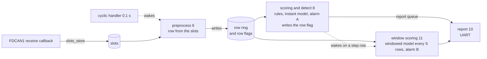

# Board goal with a windowed model

How the board application grows from the instant model to a windowed one. Alarm A,
the rules and the instant model, is the detector and runs on time every tick. The
windowed model is an aid to it. So it runs below the tasks that raise alarm A, at a
lower rate than the instant model, and lower still when the CPU is short. Its outputs
come after alarm A's. Nothing here is built yet.

## Frames and rows

The FDCAN receive interrupt stays as it is. `slots_store` overwrites the slot of the
frame's PGN and returns, so a frame is never lost to work done after it. Everything
that reads more than one moment works on the 0.1 s rows the preprocess task builds
from the slots, never on frames.

A rule that compares a signal with its previous value, like `change_limit`, compares
a row with the row before it. The time between them is the tick, 0.1 s, rather than
the gap between two frames, so a burst of frames cannot shrink it. Its limits are
measured on rows, since a row folds several frames into one step and moves slower
than a frame does.

Rules that read over time run on rows. The two were compared as follows.

| | on frames | on rows |
|---|---|---|
| what it sees | every frame, as often as it is sent, 20 ms for EEC1. A frame slipped in between ticks and overwritten before the next one is seen | the last frame of each PGN at each tick. A frame overwritten before the tick is seen by neither the rules nor the models |
| where it runs on the board | inside the receive interrupt, or in a task fed by a frame queue added for it | in a task after the row is built, with the interrupt unchanged |
| cost | grows with the frames on the bus | fixed per tick |
| time between two readings | the gap between two frames of the PGN, which the truck holds to its period. No pair of frames arrives early, so a burst is not what inflates the rate | 0.1 s. The frames behind two rows are not 0.1 s apart, and a PGN sent every 100 ms can update 0 or 2 times between ticks, showing a rate of 0 or double. Not measured |
| limits | the current `LIMITS`, measured between frames | measured on rows, and far tighter |
| against the models | sees finer time than the models, which read rows, so as a floor it is not level with them | reads the same rows as the models |
| joining the row flags | needs each hit turned into whether one fell since the last tick | the hit is already a row flag |
| delay | the frame's arrival | up to one tick |

Both were measured on the non-test logs, and are written up in
[attack/measurements.md](../../attack/measurements.md).

The frames arrive on their period. Over 200 logs read frame by frame, not one pair of
frames of a PGN arrives inside half its usual gap, and the fastest jumps are measured
over an ordinary gap. So the tail of the frame limits is the signal moving, or a bad
reading, and not a burst dividing by a short gap.

A row is the tighter step of the two. Over 2,062,116 steps of the non-test logs, taken
between two moving rows one tick apart, a signal moves this far.

| signal | 1e-3 | 1e-4 | 1e-5 | most | the frame limit now |
|---|---|---|---|---|---|
| wheel_speed | 14.0 | 21.0 | 37.8 | 300 | 50.0 |
| tachograph_speed | 14.0 | 21.0 | 33.0 | 171 | 100.0 |
| steering_angle | 5.16 | 7.29 | 9.53 | 11.1 | 40.0 |
| yaw_rate | 0.21 | 0.28 | 0.37 | 0.49 | 3.0 |

yaw_rate never moves further than 0.49 rad/s2 in a row, against a frame limit of 3.0.
Signals the frame rule could not bound come out bounded on a row, engine_speed at 2,825
rpm/s, actual_engine_torque at 490 and brake_pedal at 360. input_shaft_speed,
clutch_slip and the gears still move their whole range in one row, so no limit fits
them either way.

Such a rule is cheap, so scoring and detect runs it every tick and it goes into
alarm A. It reads the row before from the ring.

## Windows

A window is the last W rows of a run. Each row in the ring carries its position, the
rows before it in the run. The run starts again whenever a row number is not one more
than the one before, which happens on a quiet tick, a tick before every PGN has
arrived, a tick below the moving speed, and a row the ring overwrote before it was
read. A flagged row does not end a run. A window therefore never spans a gap, and the
PC cuts its windows by the same rule, over moving rows one tick apart inside a grid
segment.

The first W − 1 rows of every run get no window, and neither does a run shorter than
W. Those rows are left to the rules and the instant model. Over grid
`20260922-093129` the share of moving rows a window covers is this.

| W | rows | moving rows covered | runs shorter than W |
|---|---|---|---|
| 10 | 1 s | 97.6% | 11.3% |
| 20 | 2 s | 95.1% | 15.3% |
| 50 | 5 s | 88.1% | 21.5% |

A window of 50 rows of 17 floats is 3.4 KB.

## Tasks

The numbers are task priorities, smaller runs first.

| task | what it does | when it falls behind |
|---|---|---|
| preprocess | builds a row every tick, numbers it and writes it into the ring | must not happen |
| scoring and detect | reads each new row, runs the rules and the instant model, raises alarm A, writes the row flag | the ring overwrites the oldest rows, which are counted as dropped |
| report | prints over UART | lines wait, nothing is lost |
| window scoring | copies the latest window and its row flags, runs the windowed model, raises alarm B | windows in between are skipped |

preprocess writes the ring because it makes the rows and numbers them, so it never
misses one. The rows sit in one ring, and the row flags in an array beside it. Each has
one writer, preprocess for the rows and scoring and detect for the flags. Both readers
take a mutex (`TA_INHERIT`) while they copy. A message buffer would mask interrupts for
the copy, and the mutex does not. How long preprocess waits on it is not measured.

scoring and detect wakes window scoring on a step row, after it has written that row's
flag, so a window's flags are all there when it is copied.

W and S are the windowed model's parameters. They sit in its config header, not in the
application.

## The window task

The windowed model runs at a lower rate than the instant model. The instant model
scores every row, once every 0.1 s. The windowed model scores one window every S
rows. A step row is one whose position is at least W − 1 and whose position minus
W − 1 is a multiple of S. The rule is fixed, so the PC picks the same windows and the
board's alarm B can be compared with the PC's.

S is taken from the model's time measured on the board. W is reported at several
values and the one the board runs is chosen by Flash and time. Neither is chosen by
the attacks.

Under heavier load the rate drops further on its own. When window scoring is still
busy at a new step row, it takes only the latest window when it is free, so it never
runs more than one inference behind and the windows in between go unscored.

## Two alarms

Alarm A is the rules, including those that read the past, OR the instant model, row by
row, then the alarm rule in `detect`. It is raised on time every tick.

Alarm B is the window floor OR the windowed model, per window. The window floor is
the row flags of alarm A, set on k of the window's W rows. Alarm B is not raised where
alarm A is ringing. It comes late and may skip windows under load.

Alarm outputs come as two tasks, CAN send and a Flash recorder, alarm A before B. UART
stands in for both now. Its print masks interrupts while it waits on each character.

## Load to show the priorities working

The entry should show alarm A staying on time while load pushes the window task to a
wider stride and then to skipped windows. Work an ECU commonly carries serves as that
load.

| work | what it does | how it loads the CPU |
|---|---|---|
| event recorder | writes the frames or rows around an alarm to Flash | Flash erase and write are slow and come in bursts |
| SecOC | checks a MAC, such as AES-CMAC, on each frame | grows with the bus load. Whether the H533's AES hardware can do it is not checked |
| J1939 diagnostics | reassembles TP.CM and TP.DT and reads DM1 fault codes | light but always present |
| gateway | forwards filtered frames to FDCAN2 | has its own deadline, so it would sit above detection |
| self check | computes a CRC over Flash on a period | heavy and periodic, and can wait |

## Open

- The windowed model's time per window on the board at 32 MHz, which sets S.
- How alarm B holds across skipped windows.
- How long preprocess waits on the mutex.
- Which load the entry carries.
