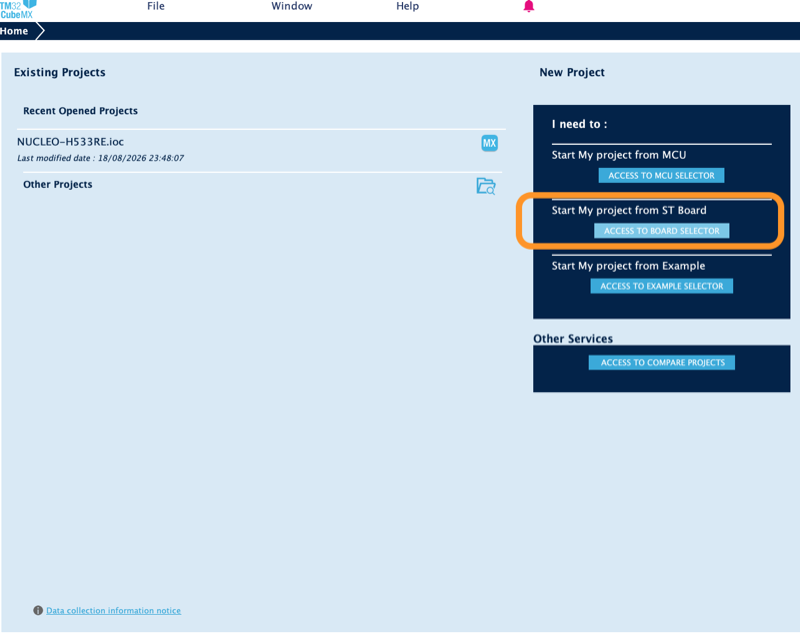
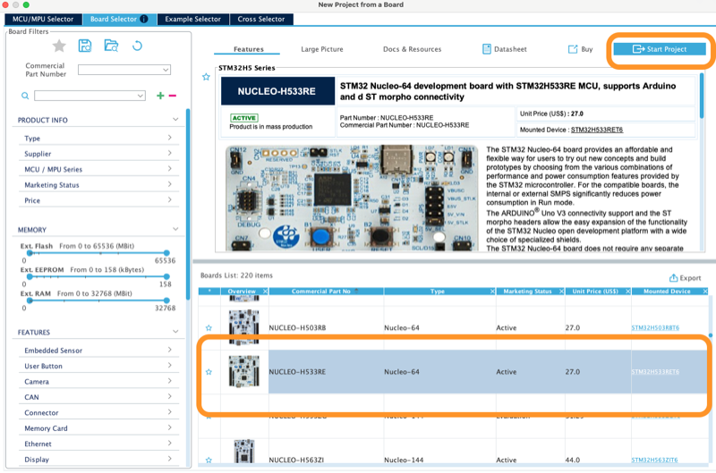
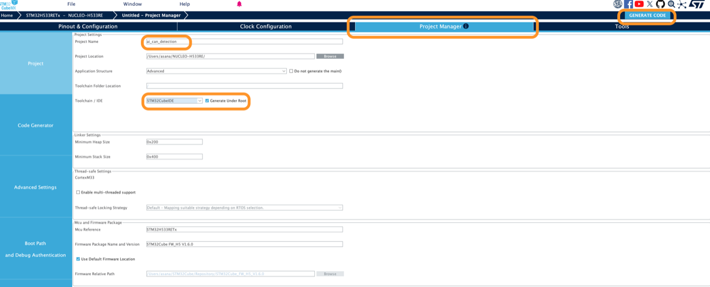
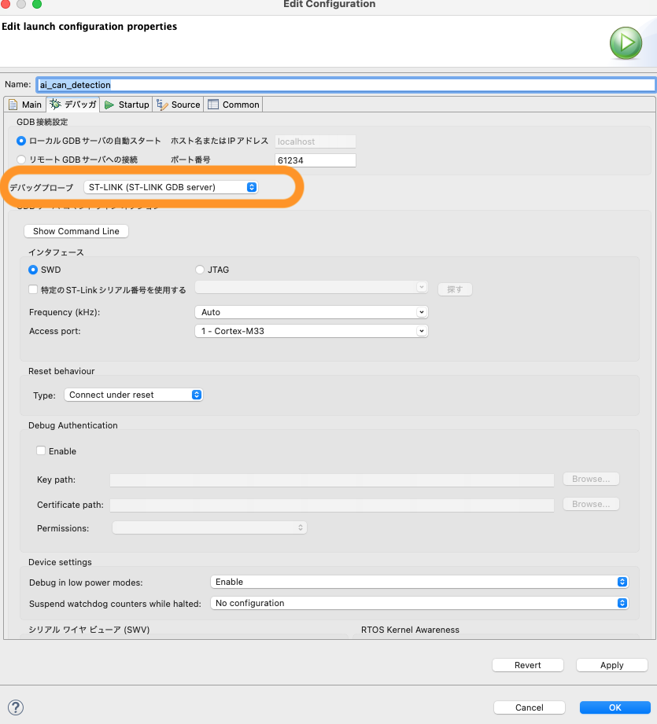

# Board setup

How to go from nothing to our μT-Kernel application running on a NUCLEO-H533RE. The
check that it runs is a count printed on the ST-LINK virtual COM port every 500 ms, while
the green LED blinks.

The steps follow section 4 of the
[mtk3_bsp2 STM32Cube document](https://github.com/tron-forum/mtk3_bsp2/blob/main/doc/bsp2_stm32_cube_jp.md#4-%E3%83%97%E3%83%AD%E3%82%B0%E3%83%A9%E3%83%A0%E3%81%AE%E4%BD%9C%E6%88%90%E6%89%8B%E9%A0%86).
`board/prepare.py` does the steps it has you do by hand. The CubeMX project lives outside
this repository. This repository holds only what we wrote:

| path | what it is |
|---|---|
| `board/application/` | our applications, one folder each with its own `usermain` |
| `board/application/alive/` | the one this page checks, the LED and the count |
| `board/patches/` | a fix to mtk3_bsp2 `1ab52cc`, which does not build for this board without it |
| `board/prepare.py` | adds mtk3_bsp2 and our application to a generated project |

## What to install

| tool | version |
|---|---|
| STM32CubeMX | 6.17.0, not STM32CubeMX2 |
| STM32Cube FW_H5 | V1.6.0 |
| STM32CubeIDE | 2.1.1 |
| libusb | `brew install libusb` |

## Connecting the board on macOS

Connect it through a USB 2.0 hub. Plugged straight into a Mac with Apple silicon, the ST
tools time out talking to the ST-LINK. To check that it is there:

```
ls /dev/tty.usbmodem*
```

A new board needs an ST-LINK firmware upgrade before first use. Ours was upgraded on
Windows. Whether the upgrade works from macOS is not known.

## 1. Generate the project in CubeMX

1. Access to Board Selector, then `NUCLEO-H533RE`, Start Project. Turn TrustZone off
   when asked.

   
   

2. Project Manager:
   - Project Name, any. The examples below use `ai_can_detection`.
   - Project Location, any directory outside this repository. The examples below use
     `~/NUCLEO-H533RE`, so the project directory is `~/NUCLEO-H533RE/ai_can_detection`.
   - Toolchain/IDE `STM32CubeIDE`, with Generate Under Root checked.

   
3. Generate Code. Check all BSP parts in the popup. Close the popup that follows.

## 2. Add mtk3_bsp2 and our application

The last argument is the application to build, a folder of `board/application/`. Run
this before the project is opened in CubeIDE, which rewrites the project files while it
is open. Running it again changes nothing.

```
python3 ~/ai_can_detection/board/prepare.py ~/NUCLEO-H533RE/ai_can_detection alive
```

Where this differs from the BSP2 document:

- `knl_start_mtkernel()` goes in `USER CODE BEGIN WHILE` of `main.c`, after
  `BSP_COM_Init()`. The document's `USER CODE BEGIN 2` starts the kernel before the COM
  port is up.
- mtk3_bsp2 is checked out at `1ab52cc` with its submodule at the commit `1ab52cc`
  records. The document's `--recursive` clone takes the latest.
- Our application is the folder `application` in the project, a link to the chosen
  folder of `board/application/`.
- The folder `common` in the project links to `board/common/`, code the applications
  share.

After CubeMX generates again, run `prepare.py` again. To build another application,
close the project in CubeIDE, run `prepare.py` with that folder, and open it again.

## 3. Build and flash in CubeIDE

1. File, Import, General, Existing Projects into Workspace, with the project directory
   as root. Leave Copy projects into workspace unchecked.
2. Select the project, then Project, Build Project. The console ends with `Build
   Finished` and 0 errors.
3. Run, Run As, STM32 C/C++ Application. The first time, a launch configuration dialog
   opens. Keep Debug probe `ST-LINK (ST-LINK GDB server)` and press OK. The console ends
   with `Download verified successfully`.

   

The green LED then blinks. To read the count, with the virtual COM port at 115200 8N1:

```
screen /dev/tty.usbmodem* 115200
```

It prints `usermain 1`, `usermain 2` and on, one line every 500 ms. Quit `screen` with
Ctrl-A, K, then y. If the LED stays off and nothing prints, mtk3_bsp2's empty default
`usermain` was built instead of ours.
