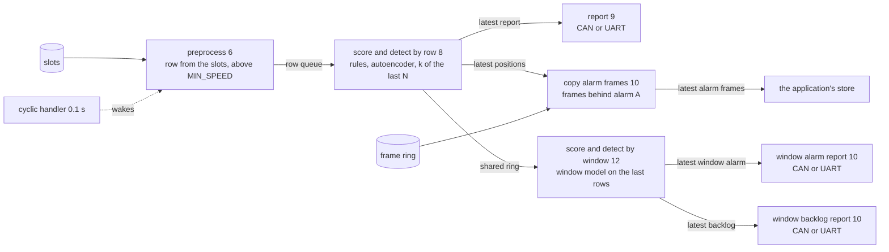

# ai_can_anomaly_detection_tasks

The tasks that turn the slots into alarms. ai_can_anomaly_detection and
can_path_from_flash both run them. They differ in what fills the slots and in the tasks
that report the alarms, which the application makes. It makes one for the alarm, at 9,
and one for the window alarm, at 10, with the alarm's ID, `ALARM_ID` or `WINDOW_ALARM_ID`.
It makes one for the window backlog, at 10, with `WINDOW_BACKLOG_ID`.

| application | reports with |
|---|---|
| ai_can_anomaly_detection | [report_can](../report_can), one frame on FDCAN1 |
| can_path_from_flash | [report_uart](../report_uart), one line over UART |

The numbers are task priorities, smaller runs first.

## Preprocessing

On each tick preprocessing copies the slots into a row. It sends the row on when a
frame has arrived since the last tick, every PGN has arrived, and the wheel speed is
above `MIN_SPEED`. The row number counts ticks, so a row it does not send leaves a gap
and the alarm count restarts there. After 1 s with no frame it clears the slots, as
`grid_sample` does across a gap.

A tick with no new frame sends no row, since the row would hold only old values. The
PC holds them across a gap up to 1 s, so there the board sends fewer rows. A J1939 bus
goes 0.1 s without a frame only when it or its senders stop.

## Priorities

A task sits in one of two layers, and the layer sets its priority.

The guaranteed layer holds the rules and the instant model. A row built in one tick is
scored and its alarm raised before the next tick. Nothing in it is dropped. The board
can promise this, with 0.90 ms of inference against a 0.1 s tick.

The best-effort layer holds detection the board cannot promise, since an ECU cannot
hold a model large enough. The window model is the one there. It runs on the time the
guaranteed layer leaves. When it runs late, it scores the windows it missed one after
another until it catches up. When it falls more than `WINDOW_MODEL_ROWS` rows behind,
the older rows are lost and it goes on from the rows left. What it loses is only the
detections that model alone makes.

Filling the window belongs to the guaranteed layer. A row dropped before it enters the
buffer leaves a gap, and the model then scores a stretch of time that never happened.

Report sits below both guaranteed tasks and above the copy of the alarm frames. The
copy sits above the windowed model, since the frame ring overwrites the frames it has
not copied. The applications put the store of the alarm frames at 11, between the copy and the
windowed model. Below the windowed model it would get only the time that model leaves,
and the alarm frames would wait in RAM.

Score and detect by window hands its report a row when it finishes the row while the
next row is already waiting, since the window model then runs late. It also hands the
first row after rows the ring overwrote, with the number lost. Rows are lost only there,
so a jump in `row_count_since_gap` within a run counts them. When the first row taken
starts a new run, the rows of that run before it count as lost.

Score and detect by row hands report only the latest alarm state, as the CAN receive
interrupt hands preprocessing the slots. A new state goes over the one before. So
writing never waits for report, and report always gets the current state.

## Copying the frames behind alarm A

On each tick preprocess reads the frame ring's position once, and gives the row the
positions at the tick before and at its own. So each row names the frames that arrived
since the tick before.

When alarm A starts, score and detect by row passes the row it starts on and the
positions of the frames behind the last `ALARM_FRAMES_ROWS` rows, 2.4 s, or fewer since
the last gap. As with report, only
the latest positions are kept.

The copy takes the latest `ALARM_FRAMES_MAX` of those frames, oldest first, without
stopping interrupts. It then reads the ring's position again. When newer frames went
over any of those it copied, it keeps none, and the record holds only the row. It hands
the alarm frames on, again keeping only the latest of each alarm. The record says which
alarm it is for. Their record is in
[store_alarm_frames_input.h](../store_alarm_frames/store_alarm_frames_input.h).

When the frames of both the alarm by row and the window alarm wait, the copy and the
store take those of the alarm by row first. So the records go to Flash in the order the
alarms started, unless both wait at once. A record can fill a whole Flash area, too
large to keep several waiting in RAM in the order they came.

## Passing rows

Score and detect by row puts each row in a shared ring, with whether the row was
flagged, the row's place since the last gap, 0 for the first row after it, and the
positions of the frames to copy if the window alarm starts on it.

Score and detect by window first copies every row in the shared ring at once, and the
shared ring is emptied. It may hold several rows, since score and detect by window has
a lower priority. The task then adds the copied rows to its window one at a time. After
each row, it checks whether the window is complete, and if so scores it.

The shared ring holds `WINDOW_MODEL_ROWS` rows. A new row on a full ring goes over the
oldest one not read. The rows left then do not follow the window's newest row in their
place since the last gap. So the window empties and fills again from them. A window
that needs a lost row is not scored, and no window spans the lost rows.

## Scoring a window

The window is `WINDOW_MODEL_ROWS` rows, and one is scored every `WINDOW_MODEL_STRIDE`
rows. Each row is z-scored with the scale of the window model's own fit, the model runs
on the window, and the score is the mean squared error on its last row, as on the PC.

A row is flagged when the window ending on it scores above `WINDOW_THRESHOLD_SCORE`, and
a row no window ends on is not. The window alarm rings while
`MIN_FLAGGED_WINDOWS_FOR_ALARM` of the last `DETECT_BY_ROW_RECENT_FLAGS` rows are
flagged, and a gap in the row numbers starts the count again, as for the alarm. This is
the window model's alarm `evaluate.run_window_test_set` counts.
