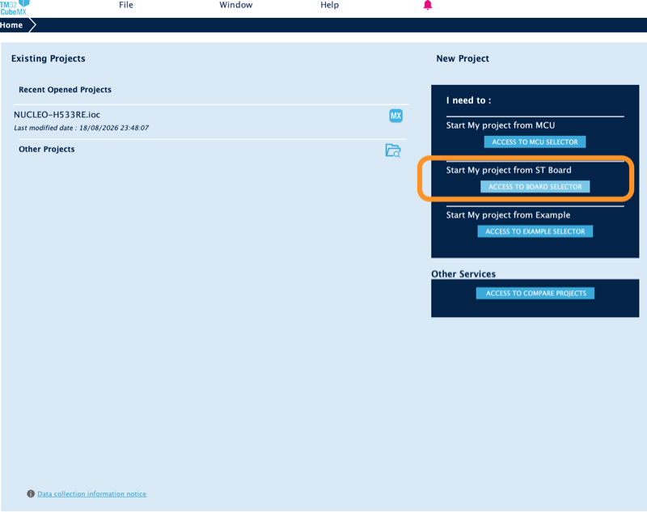
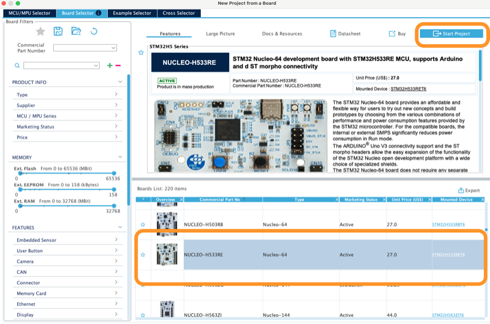
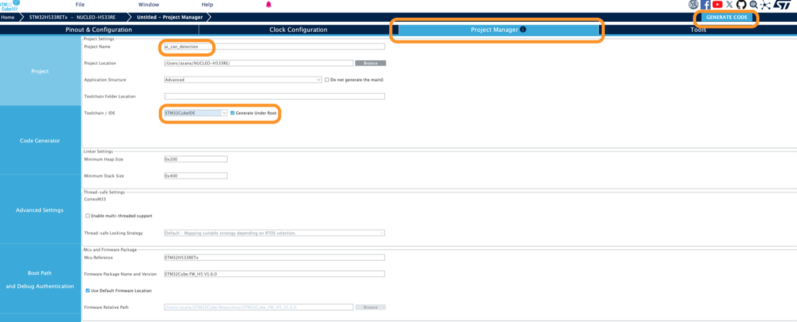

# ボードで動かす手順

NUCLEO-H533RE の上で μT-Kernel 3.0 ([mtk3_bsp2](https://github.com/tron-forum/mtk3_bsp2))
を動かし、CAN バスから受けたフレームで異常を検知するまでの手順。

## 必要なもの

| もの | 型番、版 |
|---|---|
| マイコンボード | STMicroelectronics NUCLEO-H533RE |
| CAN トランシーバ | Microchip MCP2562FD-E/P (8 ピン DIP) |
| USB-CAN アダプタ | DSD TECH SH-C31A (candleLight ファームウェア) |
| 終端抵抗 | 120 Ω を 2 本 |
| USB ハブ | USB 2.0 のもの。Apple シリコンの Mac に直接挿すと ST のツールが ST-LINK との通信でタイムアウトする |
| STM32CubeMX | 6.17.0 (STM32CubeMX2 ではない) |
| STM32Cube FW_H5 | V1.6.0 |
| STM32CubeIDE | 2.1.1 |
| libusb | `brew install libusb` |

新品のボードは最初に ST-LINK のファームウェアを更新する。

## 1. CubeMX でプロジェクトを作る

できあがる設定は [board/cubemx/ai_can_detection.ioc](board/cubemx/ai_can_detection.ioc)
にある。この `.ioc` を CubeMX で開けば以下の操作は済んだ状態になる。

### ボードを選ぶ

1. Access to Board Selector を開き、`NUCLEO-H533RE` を選んで Start Project を押す。
   TrustZone を使うか聞かれたら無効にする。

   
   

2. Project Manager タブで次のように設定する。

   | 項目 | 値 |
   |---|---|
   | Project Name | 任意。以下の例では `ai_can_detection` |
   | Project Location | このリポジトリの外の任意のディレクトリ。以下の例では `~/NUCLEO-H533RE` |
   | Toolchain/IDE | `STM32CubeIDE`。Generate Under Root にチェック |

   

### FDCAN1 のピン

Pinout & Configuration タブのピン配置図で、PB8 をクリックして `FDCAN1_RX` を、PB7
をクリックして `FDCAN1_TX` を選ぶ。

### FDCAN1 のパラメータ

Connectivity の FDCAN1 で Mode の Activated にチェックを入れ、Parameter Settings
を次のようにする。表にない項目は初期値のまま。

| 項目 | 値 |
|---|---|
| Frame Format | Classic mode |
| Mode | Normal mode |
| Auto Retransmission | Enable |
| Nominal Prescaler | 2 |
| Nominal Sync Jump Width | 8 |
| Nominal Time Seg1 | 55 |
| Nominal Time Seg2 | 8 |

FDCAN のクロックが 32 MHz のとき、この値で 250 kbit/s、サンプルポイント 87.5% になる。
記録した車両のバスは 250 kbit/s である。

### 受信割り込み

System Core の NVIC で `FDCAN1 interrupt 0` の Enabled にチェックを入れ、Preemption
Priority を 1 にする。

μT-Kernel の割り込み禁止は優先度 1 から 15 の割り込みを止める。受信割り込みを 1
にすると、割り込み禁止の間に受信処理が割り込むことはない。

### クロック

Clock Configuration タブで次のように設定する。SYSCLK と APB1 は初期値の 32 MHz
のまま。

| 項目 | 値 |
|---|---|
| PLL Source Mux | CSI (4 MHz) |
| PLL1 の N | 128 |
| PLL1 の Q | 16 |
| FDCAN Clock Mux | PLL1Q |

FDCAN のクロックは 32 MHz になる。APB1 より速くすると、FDCAN1 は受信したフレーム
をメッセージ RAM に書き込めずに捨てることがある。

### コードを生成する

Generate Code を押す。出てくるポップアップでは BSP の項目をすべてチェックし、
次のポップアップは閉じる。

## 2. 配線

MCP2562FD の各ピンを次のようにつなぐ。CN7 と CN10 は NUCLEO-H533RE の ST morpho
コネクタで、ピン番号は UM3121 の Table 17 による。

| MCP2562FD のピン | つなぐ先 |
|---|---|
| 1 TXD | CN10 の 5 番、PB7 |
| 2 VSS | GND、CN7 の 20 番 |
| 3 VDD | CN7 の 18 番、5V |
| 4 RXD | CN10 の 36 番、PB8 |
| 5 VIO | CN7 の 16 番、3V3 |
| 6 CANL | USB-CAN アダプタの CANL |
| 7 CANH | USB-CAN アダプタの CANH |
| 8 STBY | GND |

VDD は 5 V を受け、VIO がロジックの電圧をボードの 3.3 V に合わせる。STBY を High
にするとトランシーバは送信しなくなるので GND につなぐ。

バスの両端に 120 Ω を 1 本ずつ入れ、USB-CAN アダプタの GND もボードと同じ GND に
つなぐ。

## 3. USB-CAN アダプタ

SH-C31A は USB 上で `canable2 gs_usb` (VID 0x1d50、PID 0x606f) として見え、シリアル
ポートはない。

### macOS

macOS にはこのアダプタのドライバがないので、Python から `pyusb` と `gs_usb` で USB
越しに動かす。

```sh
brew install libusb
python3 -m pip install --user pyusb gs_usb
```

フレームを送るスクリプト
[send_test_frames.py](board/application/ai_can_anomaly_detection/send_test_frames.py)
は、Homebrew の libusb をパスで読み込み、250 kbit/s のビットタイミングを自分で設定
する。

### Ubuntu

Linux ではカーネルの `gs_usb` ドライバが SocketCAN の `can0` として扱う。
`can-utils` を入れておけば、次のコマンドで 250 kbit/s で立ち上げ、流れるフレームを
すべて表示する。

```sh
sudo ip link set can0 type can bitrate 250000 sample-point 0.875
sudo ip link set can0 up
candump -t d -e can0
```
