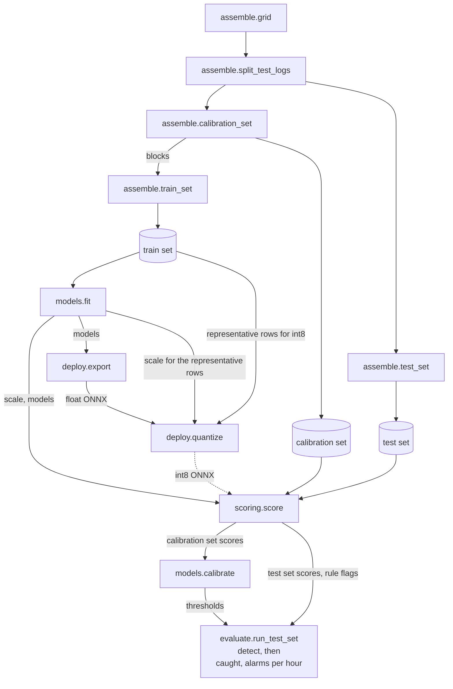

# evaluate

Measures what each detector catches on the attacked test rows [assemble](../assemble)
built.

A detector is the instant rules, or the rules together with one model. The models are
there to catch what the rules miss, so each one is compared with the rules alone. The
component count `k` is how many numbers a row is compressed into. PCA keeps `k`
components, and each autoencoder gets the same `k` as its `latent_dim`, so every model
is compared at the same `k`. PCA is the linear baseline, so the gap between it and the
nonlinear autoencoder is what the nonlinearity buys.

```
python3 -m evaluate.run_test_set REPO REVISION TEST_SET LOCAL_DIR RUNS_REPO REVISION THRESHOLDS RUNS_DIR
```

The stages it comes after, each writing one directory of the Hub.



Documented under [docs/](docs).

- [run_test_set](docs/run_test_set.md) counts what each detector catches on the
  attacked test rows.

What the runs found is in [results](results.md).

## Tests

Run from the repository root.

```
python3 -m pytest
```
