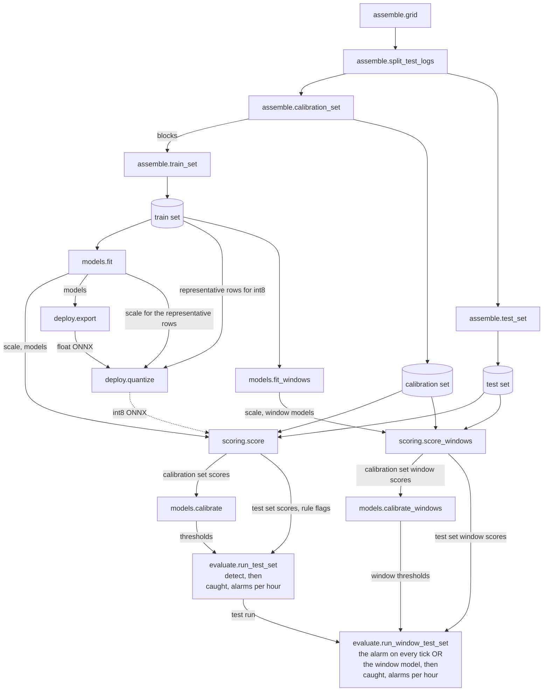

# evaluate

Measures what each detector catches on the attacked test rows [assemble](../assemble)
built.

A detector is the instant rules, or the rules together with one model. The models are
there to catch what the rules miss, so each one is compared with the rules alone. The
component count `k` is how many numbers a row is compressed into, the autoencoder's
`latent_dim`. PCA and the linear autoencoder were the linear baselines of the instant
pair, which is finished. The runs now fit the
nonlinear autoencoder alone.

```
python3 -m evaluate.run_test_set REPO REVISION TEST_SET LOCAL_DIR RUNS_REPO REVISION THRESHOLDS RUNS_DIR
python3 -m evaluate.run_window_test_set RUNS_REPO REVISION TEST_RUN REVISION WINDOW_THRESHOLDS LOCAL_DIR RUNS_DIR
python3 -m evaluate.detection_table RUNS_REPO REVISION LISTED LOCAL_DIR RUNS_DIR OUT
```

The stages it comes after, each writing one directory of the Hub.


```mermaid
flowchart TB
    grid["assemble.grid"] --> split["assemble.split_test_logs"] --> calibration_set["assemble.calibration_set"] & test_set["assemble.test_set"]
    calibration_set -- blocks --> train_set["assemble.train_set"]
    train_set --> train[(train set)]
    calibration_set --> calibration[(calibration set)]
    test_set --> test[(test set)]
    train --> fit["models.fit"]
    fit -- scale, models --> score["scoring.score"]
    calibration --> score
    test --> score
    score -- calibration set scores --> calibrate["models.calibrate"]
    score -- test set scores, rule flags --> run["evaluate.run_test_set<br/>detect, then<br/>caught, alarms per hour"]
    calibrate -- thresholds --> run
    fit -- models --> export["deploy.export"] -- float ONNX --> quantize["deploy.quantize"]
    train -- representative rows for int8 --> quantize
    fit -- scale for the representative rows --> quantize
    quantize -. int8 ONNX .-> score
    train --> fit_windows["models.fit_windows"]
    fit_windows -- scale, window models --> score_windows["scoring.score_windows"]
    calibration --> score_windows
    test --> score_windows
    score_windows -- calibration set window scores --> calibrate_windows["models.calibrate_windows"]
    score_windows -- test set window scores --> run_windows["evaluate.run_window_test_set<br/>the alarm on every tick OR<br/>the window model, then<br/>caught, alarms per hour"]
    calibrate_windows -- window thresholds --> run_windows
    run -- test run --> run_windows
```

Documented under [docs/](docs).

- [run_test_set](docs/run_test_set.md) counts what each detector catches on the
  attacked test rows.
- [run_window_test_set](docs/run_window_test_set.md) counts what each window model
  adds to the alarm on every tick.
- [detection_table](docs/detection_table.md) puts the test runs and window test runs
  it is given side by side as Markdown tables.

## Tests

Run from the repository root.

```
python3 -m pytest
```
