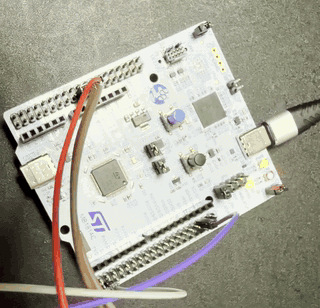

# ボードで動かす手順

NUCLEO-H533RE の上で μT-Kernel 3.0 ([mtk3_bsp2](https://github.com/tron-forum/mtk3_bsp2))
を動かして CAN バスから受けたフレームで異常を検知するまでの手順。

メインのデモは [7](#7-メインのデモ-ai_can_anomaly_detection-で異常を検知する) の `ai_can_anomaly_detection` である。

## 目次

- [必要なもの](#必要なもの)
- [1. CubeMX でプロジェクトを作る](#1-cubemx-でプロジェクトを作る)
- [2. 配線](#2-配線)
- [3. USB-CAN アダプタ](#3-usb-can-アダプタ)
- [4. mtk3_bsp2 とアプリケーションをプロジェクトに入れる](#4-mtk3_bsp2-とアプリケーションをプロジェクトに入れる)
- [5. ビルドと書き込み](#5-ビルドと書き込み)
- [6. CAN バスを確かめる](#6-can-バスを確かめる)
- [7. メインのデモ: ai_can_anomaly_detection で異常を検知する](#7-メインのデモ-ai_can_anomaly_detection-で異常を検知する)
  - [7.1 デモの準備](#71-デモの準備)
  - [7.2 デモ: CAN 異常検知](#72-デモ-can-異常検知)
    - [7.2.1 ボードにフレームを送る](#721-ボードにフレームを送る)
    - [7.2.2 Flash の記録を見る](#722-flash-の記録を見る)

## 必要なもの

| もの | 型番 |
|---|---|
| マイコンボード | STMicroelectronics NUCLEO-H533RE |
| CAN トランシーバ | Microchip MCP2562FD-E/P (8 ピン DIP) |
| USB-CAN アダプタ | DSD TECH SH-C31A (candleLight ファームウェア) |
| 終端抵抗 | 120 Ω を 2 本 |
| USB ハブ | USB 2.0 のもの。Apple シリコンの Mac に直接挿すと ST のツールが ST-LINK との通信でタイムアウトする |

### ソフトウェア

ST のツールは st.com からダウンロードして展開しインストーラを開く。ダウンロードにはログインが要る。

| もの | 版 | macOS | Ubuntu |
|---|---|---|---|
| STM32CubeMX | 6.17.0 (STM32CubeMX2 ではない) | `SetupSTM32CubeMX-6.17.0-Mac-ARM.app.tar.gz` の `SetupSTM32CubeMX-6.17.0` | `stm32cubemx-lin-v6-17-0.zip` の `SetupSTM32CubeMX-6.17.0` |
| STM32Cube FW_H5 | V1.6.0 | CubeMX の Help、Manage embedded software packages。最初の起動の数分は `The update is already in use` と出るので待つ | 同じ |
| STM32CubeIDE | 2.1.1 | `st-stm32cubeide_2.1.1_28236_20260312_0043_aarch64.dmg.zip` | `st-stm32cubeide_2.1.1_28236_20260312_0043_amd64.deb_bundle.sh.zip`。中身を `sudo sh` で実行する |
| STM32CubeProgrammer | 2.23.0 | `SetupSTM32CubeProgrammer_macos_arm.zip` の `SetupSTM32CubeProgrammer-2.23.0` | `SetupSTM32CubeProgrammer_linux_64.zip` の `SetupSTM32CubeProgrammer-2.23.0.linux` |
| ST-LINK のファームウェア | | 新品のボードは CubeProgrammer の Firmware upgrade で更新する | 同じ |
| ST Edge AI Core | 4.0.1 | `stedgeai-macarm.zip` の `stedgeai-macarm-onlineinstaller.dmg`。STM32 MCU のコンポーネントを選ぶ | `stedgeai-lin.zip` の `stedgeai-linux-onlineinstaller`。STM32 MCU のコンポーネントを選ぶ |
| Python | 3.9 | [下の手順](#python-を用意する) | 同じ |
| libusb | | `brew install libusb` | 要らない |
| Qt の xcb のライブラリ | | 要らない | ST Edge AI Core より先に `sudo apt install libxcb-icccm4 libxcb-image0 libxcb-keysyms1 libxcb-render-util0` |
| can-utils | | 要らない | `sudo apt install can-utils` |
| screen | | 入っている | `sudo apt install screen` |

### Python を用意する

ONNX Runtime 1.19.2 が入る最後の版なので 3.9 を使う。[uv](https://docs.astral.sh/uv/) で用意する。

```sh
brew install uv                                  # macOS
curl -LsSf https://astral.sh/uv/install.sh | sh  # Ubuntu
uv venv --python 3.9 .venv
source .venv/bin/activate
uv pip install -r requirements.txt
```

新しいターミナルでは `source .venv/bin/activate` を実行してから使う。

### Ubuntu の ST-LINK

CubeIDE のインストーラが udev ルールを入れる。ボードを挿し直して sudo なしで次が
`Board : NUCLEO-H533RE` を出すことを確かめる。

```sh
~/STMicroelectronics/STM32Cube/STM32CubeProgrammer/bin/STM32_Programmer_CLI -c port=SWD
```

## 1. CubeMX でプロジェクトを作る

できあがる設定は [board/cubemx/ai_can_detection.ioc](../board/cubemx/ai_can_detection.ioc)
にある。この `.ioc` を CubeMX で開き、File、Save Project As でリポジトリの外に保存すれば
以下の操作は済んだ状態になる。保存先は例えば `~/NUCLEO-H533RE/ai_can_detection` である。
`.ioc` を使ったときは [コードを生成する](#コードを生成する) だけ行って [2. 配線](#2-配線) に進む。

### ボードを選ぶ

1. Access to Board Selector を開き、`NUCLEO-H533RE` を選んで Start Project を押す。
   TrustZone を使うか聞かれたら無効にする。

2. Project Manager タブで次のように設定する。

   | 項目 | 値 |
   |---|---|
   | Project Name | 任意。以下の例では `ai_can_detection` |
   | Project Location | このリポジトリの外の任意のディレクトリ。以下の例では `~/NUCLEO-H533RE` |
   | Toolchain/IDE | `STM32CubeIDE`。Generate Under Root にチェック |

### FDCAN1 のピン

Pinout & Configuration タブのピン配置図で PB8 をクリックして `FDCAN1_RX` を選ぶ。PB7
をクリックして `FDCAN1_TX` を選ぶ。

### FDCAN1 のパラメータ

Connectivity の FDCAN1 で Mode の Activated にチェックを入れ、Parameter Settings
を次のようにする。表にない項目は初期値のまま。

| 項目 | 値 |
|---|---|
| Frame Format | Classic mode |
| Mode | Normal mode |
| Auto Retransmission | Enable |
| Nominal Prescaler | 2 |
| Nominal Sync Jump Width | 8 |
| Nominal Time Seg1 | 55 |
| Nominal Time Seg2 | 8 |

FDCAN のクロック 32 MHz から 250 kbit/s でサンプルポイント 87.5% になる値である。

### 受信割り込み

System Core の NVIC で `FDCAN1 interrupt 0` の Enabled にチェックを入れ、Preemption
Priority を 1 にする。μT-Kernel の割り込み禁止がこの割り込みも止める優先度である。

### クロック

Clock Configuration タブで次のように設定する。SYSCLK と APB1 は初期値の 32 MHz
のまま。

| 項目 | 値 |
|---|---|
| PLL Source Mux | CSI (4 MHz) |
| PLL1 の N | 128 |
| PLL1 の Q | 16 |
| FDCAN Clock Mux | PLL1Q |

FDCAN のクロックを APB1 と同じ 32 MHz にする。APB1 より速いと受信したフレームを取りこぼす。

### コードを生成する

Generate Code を押す。出てくるポップアップでは BSP の項目をすべてチェックする。
次のポップアップは閉じる。

## 2. 配線

MCP2562FD の各ピンを次のようにつなぐ。CN7 と CN10 は NUCLEO-H533RE の ST morpho
コネクタである。ピン番号は UM3121 の Table 17 による。

| MCP2562FD のピン | つなぐ先 |
|---|---|
| 1 TXD | CN10 の 5 番、PB7 |
| 2 VSS | GND、CN7 の 20 番 |
| 3 VDD | CN7 の 18 番、5V |
| 4 RXD | CN10 の 36 番、PB8 |
| 5 VIO | CN7 の 16 番、3V3 |
| 6 CANL | USB-CAN アダプタの CANL |
| 7 CANH | USB-CAN アダプタの CANH |
| 8 STBY | GND |

VIO がロジックの電圧をボードの 3.3 V に合わせる。STBY を High にすると送信しなくなる。

バスの両端に 120 Ω を 1 本ずつ入れる。USB-CAN アダプタの GND もボードと同じ GND に
つなぐ。

## 3. USB-CAN アダプタ

### macOS

macOS にはこのアダプタのドライバがない。[6](#6-can-バスを確かめる) の `bus` と
[7.2.1](#721-ボードにフレームを送る) の `send_test_frames` が `gs_usb` で USB から直接動かす。250 kbit/s も
自分で設定する。

### Ubuntu

アダプタを `can0` として 250 kbit/s で立ち上げる。最後のコマンドはバスのフレームを表示する。

```sh
sudo ip link set can0 type can bitrate 250000 sample-point 0.875
sudo ip link set can0 up
candump -t d -e can0
```

サンプルポイント 0.875 はボードの FDCAN1 の設定に合わせている。

[7.2.1](#721-ボードにフレームを送る) の `send_test_frames` は立ち上げた `can0` から送る。

## 4. mtk3_bsp2 とアプリケーションをプロジェクトに入れる

CubeMX が生成したプロジェクトに `board.prepare` で mtk3_bsp2 とアプリケーションを
加える。引数は `board/application/` の下のフォルダ名で、ビルドするアプリ
ケーションを選ぶ。パッチを当てた mtk3_bsp2 `1ab52cc` を取得して `main.c` に
カーネルの起動を入れる。そしてアプリケーションと `board/lib/` をプロジェクトにリンクする。

`board.prepare` と `board.flash` はプロジェクトとツールの場所を `board/paths.json`
から読む。既定の場所に入れたときのものをコピーして始める。違う場所に入れたものは書き換える。

```sh
cd ~/ai_can_detection
cp guidelines/paths.mac.json board/paths.json      # macOS
cp guidelines/paths.ubuntu.json board/paths.json   # Ubuntu
python3 -m board.prepare alive
```

CubeIDE でプロジェクトを開いている間は実行しない。CubeIDE が開いている間にプロ
ジェクトのファイルを書き換える。別のアプリケーションに替えるときは CubeIDE で
プロジェクトを閉じてから実行し直す。CubeMX でコードを生成し直したときも実行し直す。

`board.prepare` は `board/patches` のパッチを `git am` で当てる。git の `user.name` と `user.email` を設定しておく。

## 5. ビルドと書き込み

書き込みはコマンドラインか CubeIDE のどちらかで行う。

### コマンドラインで行う

CubeIDE を閉じてからリポジトリのトップで実行する。

```sh
python3 -m board.flash
```

ビルドして SWD で書き込み、照合してマイコンをリセットする。

### CubeIDE で行う

1. File、Import、General、Existing Projects into Workspace を選び、プロジェクトの
   ディレクトリをルートにする。Copy projects into workspace にはチェックを入れない。
2. プロジェクトを選び、Project、Build Project を選ぶ。コンソールの最後に
   `Build Finished` とエラー 0 が出る。
3. Run、Run As、STM32 C/C++ Application を選ぶ。初回は起動設定のダイアログが開く。
   Debug probe は `ST-LINK (ST-LINK GDB server)` のまま OK を押す。コンソールの最後に
   `Download verified successfully` が出る。

### UART を見る

ST-LINK の仮想 COM ポートを別のターミナルで `screen` で開く。macOS では
`/dev/cu.usbmodem` の後ろに番号が付く。番号は挿し直すと変わることがある。

```sh
ls /dev/cu.usbmodem*
screen /dev/cu.usbmodem11202 115200   # macOS。ls で出た名前にする
screen /dev/ttyACM0 115200            # Ubuntu
```

`screen` を抜けるときは `Ctrl-A` を押してから `\`。

Ubuntu では CubeIDE が入れた ST-LINK の udev ルールにより、読み書きできるのは
`plugdev` グループのユーザとデスクトップにログインしているユーザになる。SSH で
つないだときも読めるように `groups` で `plugdev` に入っていることを確かめる。
Ubuntu のインストール時に作ったユーザは最初から入っている。入っていなければ
`sudo usermod -aG plugdev $USER` で入れてログインし直す。

## 6. CAN バスを確かめる

`can_bus_debug` でボードと PC の間をフレームが両方向に通ることを確かめる。
`can_bus_debug` は受けたフレームを UART に出す。そして `18FEF100` を 1 秒ごとに送る。

1. 2 と 3 の手順でバスをつなぐ。
2. `can_bus_debug` を書き込んで別のターミナルで UART を開く。

   ```sh
   python3 -m board.prepare can_bus_debug
   python3 -m board.flash
   ```

   ```sh
   screen /dev/cu.usbmodem11202 115200   # macOS。ls /dev/cu.usbmodem* で出た名前にする
   screen /dev/ttyACM0 115200            # Ubuntu
   ```

3. PC から `18FEF200` を 1 つ送る。

   macOS では `bus` が送ったあと Ctrl-C を押すまでバスのフレームを表示する。

   ```sh
   python3 -m board.application.can_bus_debug.bus
   ```

   Ubuntu では 3 の手順の `candump` を開いたまま別のターミナルで送る。

   ```sh
   cansend can0 18FEF200#1111111111111111
   ```

4. 次のように出ればバスは動いている。

   | どこ | 出るもの |
   |---|---|
   | PC | ボードが送る `18FEF100` が 1 秒ごとに出る |
   | UART | 送ったフレームの `CAN RX: ID=0x18fef200 (ext) DLC=8 data=11 11 11 11 11 11 11 11` |
   | UART | 1 秒ごとの `CAN RX status: taken 1, printed 1, fifo 0, fifo lost 0, ram failed 0, rec 0, tec ...`。`taken` と `printed` が送った数になり、`fifo lost` と `ram failed` が 0 |

   `tec` は PC がアダプタを開いていない間に上がる。開いている間は下がる。

   | UART に出たもの | 意味 |
   |---|---|
   | `FDCAN start error` | FDCAN1 が起動していない |
   | `send failed` | ボードが送るフレームを送信キューに入れられなかった |

## 7. メインのデモ: ai_can_anomaly_detection で異常を検知する

2 と 3 の手順でバスと USB-CAN アダプタをつないでおく。

異常検知のアプリのタスク構成は [README の Tasks and priorities](../board/application/ai_can_anomaly_detection/README.md#tasks-and-priorities) にある。
アプリから出力する CAN フレームの形は [README の Frames it sends](../board/application/ai_can_anomaly_detection/README.md#frames-it-sends)
にある。Flash に保存する警報の記録の形は [README の Frames stored in Flash](../board/application/ai_can_anomaly_detection/README.md#frames-stored-in-flash)
にある。

ここでは `part_3/20210204093802472877.csv` を送る。行の警報も窓の警報も出るログである。
ほかのログは `attacked.json` の `log` から選ぶ。

### 7.1 デモの準備

#### 7.1.1 ai_can_anomaly_detection を書き込む

```sh
python3 -m board.prepare ai_can_anomaly_detection
python3 -m board.flash
```

6 の手順と同じく UART を開く。`reading FDCAN1` が出れば受信を始めている。警報は
UART ではなく CAN に出る。

| UART に出たもの | 意味 |
|---|---|
| `FDCAN start error` | FDCAN1 が起動していない |
| `flash store init error` | バンク 2 を読めずに止まった |

#### 7.1.2 送るフレームを取ってくる

Hugging Face のデータ用リポジトリから取ってくる。約 2 GB ある。ログインは要らない。

```sh
python3 -m board.application.ai_can_anomaly_detection.fetch
```

`board/application/ai_can_anomaly_detection/fetched/frames/` に次の 2 つが入る。

| ファイル | 中身 |
|---|---|
| `frames.parquet` | 攻撃を入れたログのフレーム。ログ 1 つは約 1 分 |
| `attacked.json` | 各ログに入れた攻撃。`log` がログの名前、`pgn` が攻撃した PGN |

#### 7.1.3 PC で同じモデルを動かす

警報が始まる行と終わる行を出す。行は送り始めから 0.1 秒ごとに数える。

```sh
python3 -m board.application.ai_can_anomaly_detection.expected part_3/20210204093802472877.csv
```

```
alarm 0x0CFF0080 start at row 503
alarm 0x0CFF0080 end at row 539
alarm 0x0CFF0180 start at row 494
alarm 0x0CFF0180 end at row 504
alarm 0x0CFF0180 start at row 539
alarm 0x0CFF0180 end at row 549
```

`0x0CFF0080` は行の警報で `0x0CFF0180` は窓の警報である。それぞれ 7.2.1 の `alarm` と `window alarm` にあたる。

#### 7.1.4 Flash のバンク 2 を消す

ボードは警報の前のフレームをバンク 2 の 8 つの場所に 1 つずつ記録する。

使い始める前に一度消す。ボードはバンク 2 に残っているものを記録として読むので、
消さずに使い始めると前のデータを記録と取り違える。

デモでは送る前に毎回消す。8 つが埋まるといちばん古い場所を消して書く。ただし 1 日
8 時間の使用で 5 年もつように、一度消すと次に消すまで約 11 分待つ。待つ間の警報は
記録しない。このログは 1 回送ると 3 つ記録するので、消さずに続けて送ると 3 回目から
記録が抜ける。

1. オプションバイトを表示する。

   ```sh
   /Applications/STMicroelectronics/STM32Cube/STM32CubeProgrammer/STM32CubeProgrammer.app/Contents/Resources/bin/STM32_Programmer_CLI -c port=SWD -ob displ   # macOS
   ~/STMicroelectronics/STM32Cube/STM32CubeProgrammer/bin/STM32_Programmer_CLI -c port=SWD -ob displ   # Ubuntu
   ```

   `SWAP_BANK` が 0 であることを確かめる。1 のときはバンクが入れ替わっている。次の消去が
   プログラムを消してしまうので、ここで止める。

2. バンク 2 を消してボードをリセットする。セクタ番号は両方のバンクを通して数えるので
   バンク 2 は 32 から 63 である。ボードは起動したときにバンク 2 を読むのでリセットする。

   ```sh
   /Applications/STMicroelectronics/STM32Cube/STM32CubeProgrammer/STM32CubeProgrammer.app/Contents/Resources/bin/STM32_Programmer_CLI -c port=SWD -e '[32' '63]' -rst   # macOS
   ~/STMicroelectronics/STM32Cube/STM32CubeProgrammer/bin/STM32_Programmer_CLI -c port=SWD -e '[32' '63]' -rst   # Ubuntu
   ```

### 7.2 デモ: CAN 異常検知

#### 7.2.1 ボードにフレームを送る

3 の手順の USB-CAN アダプタから同じログのフレームを記録された時刻の間隔で送る。約 1 分
かかる。ボードが CAN に送ったフレームは `board_frames` が届くたびに中身に直して画面に出す。

```sh
python3 -m board.application.ai_can_anomaly_detection.send_test_frames part_3/20210204093802472877.csv | tee received_frames.txt | python3 -m board.application.ai_can_anomaly_detection.board_frames -
```

2026-09-30 に動かしたときは次のように出た。

```
sending 50001 frames from 1790761388.680
row 571: window alarm start, 90 ms after the row was made
row 571: window alarm frames stored, 176 ms after the window alarm start, 2017 frames
row 572: window model late, finished 260 ms after the row was made, 0 rows lost before it
...
rows 572 to 578: window model late on 7 rows, 0 rows lost
row 581: alarm start, 0 ms after the row was made
row 581: alarm frames stored, 175 ms after the alarm start, 2018 frames
...
row 581: window alarm end, 270 ms after the row was made
row 616: alarm end, 0 ms after the row was made
row 616: window alarm start, 90 ms after the row was made
row 616: window alarm frames stored, 178 ms after the window alarm start, 2017 frames
...
row 626: window alarm end, 180 ms after the row was made
...
sent 50001, echoed 50001, late ms median 0.000, p99 0.000, max 1.772
```

最初の行と最後の行は `send_test_frames` が出す。最後の行の `echoed` が `sent` と同じなら
アダプタはすべてのフレームを送っている。`echoed` が 0 のときはアダプタが何も読めていない
ので USB から抜き差しして送り直す。

途中で止めるときは Ctrl-C で止める。`send_test_frames` は Ctrl-C のあとアダプタを閉じる。
`kill` で止めると閉じないので、次に開いたアダプタは何も読めず抜き差しが要る。`&` で
後ろに回したものは Ctrl-C も `kill -INT` も効かない。止める必要があるときは前で動かす。

間の行は `board_frames` がボードのフレームを中身に直したものである。

| 見るところ | 正しいとき |
|---|---|
| `alarm` と `window alarm` の `start` と `end` の行 | ボードの行はボードが起動してから数えるので 7.1.3 の PC の行に一定の差を足したものになる。上の例では差が 78 である。ボードが行を作る時刻は送り始めと揃っていないので、1 行程度ずれることがある。ただし窓の警報は行の警報が鳴っている行では鳴らない。PC の 504 行で終わる窓の警報はボードでは行の警報が始まる行で終わる |
| `alarm start` の ms | 0。警報は窓モデルと保存に待たされていない |
| `alarm frames stored` と `window alarm frames stored` | その警報の前のフレームを Flash に書き終えた。警報が始まるたびに 1 つ出る |
| `window model late` | 窓モデルが次の行が来るまでに採点を終えられなかった行。遅れていない行は出ない |
| `window model late on ... rows` | 窓モデルは遅れた後に追いついた。`0 rows lost` なら行を 1 つも失っていない |

窓モデルが遅れる理由は [README の Tasks and priorities](../board/application/ai_can_anomaly_detection/README.md#tasks-and-priorities) の優先度にある。

##### 7.2.1.1 LED

警報が鳴るとボードの緑の LED（LD2）が光る。行の警報だけなら速く点滅する。
窓の警報だけならゆっくり点滅する。両方なら点いたままになる。警報が終わっても 2 秒は続く。



##### 7.2.1.2 received_frames.txt

届いた生のフレームが受け取った時刻とともに残る。

```
received at 1790740247.228  CFF0180   [8]  01 65 02 00 00 5A 00 FF
received at 1790740247.404  CFF0480   [8]  65 02 00 00 E2 07 FF FF
received at 1790740247.497  CFF0280   [8]  66 02 00 00 00 00 FF FF
```

あとから `board_frames` に読ませると画面と同じ行が出る。

```sh
python3 -m board.application.ai_can_anomaly_detection.board_frames received_frames.txt
```

#### 7.2.2 Flash の記録を見る

ボードを動かしたまま Flash のバンク 2 をファイルに読み出して送ったログと突き合わせる。

```sh
/Applications/STMicroelectronics/STM32Cube/STM32CubeProgrammer/STM32CubeProgrammer.app/Contents/Resources/bin/STM32_Programmer_CLI -c port=SWD mode=HOTPLUG -u 0x08040000 0x40000 bank2.bin   # macOS
~/STMicroelectronics/STM32Cube/STM32CubeProgrammer/bin/STM32_Programmer_CLI -c port=SWD mode=HOTPLUG -u 0x08040000 0x40000 bank2.bin   # Ubuntu
python3 -m board.application.ai_can_anomaly_detection.read_alarm_frames bank2.bin --log part_3/20210204093802472877.csv
```

```
area 0 sequence 0 window alarm row 613 frames 2018
  the MAC matches the one computed with the key
  matches log frames 39540 to 41557
area 1 sequence 1 alarm row 622 frames 2020
  the MAC matches the one computed with the key
  matches log frames 40293 to 42312
area 2 sequence 2 window alarm row 658 frames 2018
  the MAC matches the one computed with the key
  matches log frames 43322 to 45339
```

記録ごとに次の 3 つが出る。どちらの警報の記録か。MAC が鍵と合うか。送ったログのどのフレームと
一致したか。MAC が合ってログのフレームと一致すれば正しく書けている。鍵は
`board/lib/alarm_frames_mac/alarm_frames_mac_demo_key.h` にある。`--log` を付けなければ
記録のフレームが出る。

